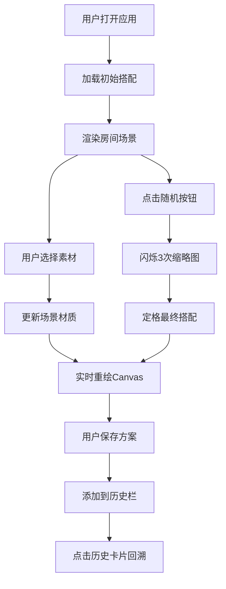

## 1. 产品概述

室内装修材料搭配与实时预览应用，帮助室内设计师快速向客户展示不同材质和颜色的地板、墙面和窗帘搭配效果，替代传统Photoshop拼接样图的低效工作方式。

- 目标用户：室内设计师、装修业主
- 核心价值：实时预览搭配效果、快速切换方案、保存对比历史搭配
- 产品定位：轻量级Web端搭配预览工具

## 2. 核心功能

### 2.1 功能模块

1. **素材选择面板**：左侧竖条状面板，分类展示地板、墙面、窗帘三类素材缩略图
2. **场景实时渲染**：右侧Canvas绘制房间透视图，实时根据选择更新材质效果
3. **方案保存与对比**：保存当前搭配为图片，历史方案可快速回溯
4. **随机搭配建议**：一键随机生成搭配方案，带有动画效果

### 2.2 页面详情

| 页面名称 | 模块名称 | 功能描述 |
|-----------|-------------|---------------------|
| 主页面 | 素材选择面板 | 三行水平滚动缩略图列表，分别对应地板、墙面、窗帘，点击即更新场景 |
| 主页面 | 场景渲染区域 | Canvas绘制标准房间透视图，包含地面、后墙、窗户与窗帘 |
| 主页面 | 保存按钮 | 右上角保存按钮，将当前canvas转为base64图片保存到历史栏 |
| 主页面 | 方案历史栏 | 页面底部水平滚动的历史方案卡片，支持点击回溯和删除 |
| 主页面 | 随机搭配按钮 | 左下角骰子按钮，随机生成搭配方案并带动画效果 |

## 3. 核心流程

### 3.1 搭配选择流程

用户打开应用 → 默认展示初始搭配 → 用户点击左侧素材缩略图 → 场景Canvas实时更新材质 → 用户可保存当前方案 → 保存的方案显示在底部历史栏 → 点击历史卡片可回溯该搭配

### 3.2 随机搭配流程

用户点击随机按钮 → 随机闪烁3次素材缩略图（每次0.15秒）→ 定格最终结果 → 场景淡入显示新搭配（0.3秒）

## 4. 用户界面设计

### 4.1 设计风格

- **配色方案**：深色侧边栏（#1E293B）与浅色主区域（#F1F5F9）对比
- **高亮色**：#38BDF8（天蓝色）
- **按钮风格**：圆角渐变按钮，悬停有位移和亮度变化
- **字体**：系统字体Inter或Segoe UI
- **图标**：Unicode字符或CSS绘制，无外部图标库依赖

### 4.2 页面设计概览

| 页面名称 | 模块名称 | UI元素 |
|-----------|-------------|-------------|
| 主页面 | 左侧素材面板 | 宽220px、深色背景#1E293B、右圆角8px、三行水平滚动缩略图（60x60px）、选中边框高亮#38BDF8 |
| 主页面 | 右侧场景区域 | 背景#F1F5F9、Canvas透视房间图、地板网格线#CBD5E1 |
| 主页面 | 保存按钮 | 120x44px、渐变背景、圆角22px、白色文字、悬停右移4px |
| 主页面 | 历史方案栏 | 底部水平滚动、卡片120x80px、圆角8px、边框#E2E8F0、悬停放大1.05倍 |
| 主页面 | 随机按钮 | 48x48px、圆形、背景#38BDF8、骰子图标、白色加粗文字 |

### 4.3 响应式

- 桌面端：左侧固定侧边栏 + 右侧场景区域
- 移动端：侧边栏折叠为底部栏（高度80px），缩略图缩小到48x48px
- Canvas自适应窗口大小，保持透视比例
- 触摸交互优化

### 4.4 动效设计

- 缩略图悬停：上移4px，0.2秒ease-out
- 选中状态：边框高亮过渡动画0.2秒
- 场景更新：淡入效果0.3秒
- 保存按钮悬停：右移4px，背景变亮
- 历史卡片悬停：放大1.05倍
- 随机搭配：快速闪烁3次后定格，整体0.8秒

## 5. 性能约束

- 素材切换渲染：100ms内完成，使用requestAnimationFrame控制帧率
- 保存图片大小：base64不超过200KB
- 窗口resize：300ms去抖后重绘
- Canvas渲染优化：避免不必要的重绘
