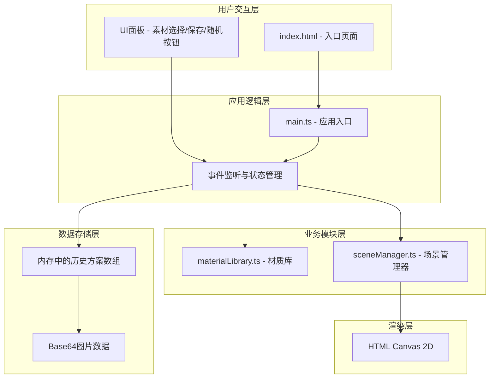

## 1. 架构设计



**数据流向说明**：
1. 用户通过 UI 面板选择材质 → main.ts 接收事件
2. main.ts 调用 materialLibrary 获取材质数据
3. main.ts 将材质组合传递给 sceneManager
4. sceneManager 更新 Canvas 渲染
5. 用户点击保存 → main.ts 从 Canvas 导出 Base64
6. 历史方案存储在内存数组中，可快速回溯

## 2. 技术说明

### 2.1 技术栈

| 类别 | 技术选型 | 版本 |
|------|----------|------|
| 构建工具 | Vite | 5.0.8 |
| 编程语言 | TypeScript | 5.3.3 |
| 渲染技术 | HTML Canvas 2D API | - |
| 样式方案 | 原生 CSS + CSS Variables | - |
| 目标版本 | ES2020 | - |

### 2.2 项目结构

```
.
├── index.html              # 入口HTML文件
├── package.json            # 项目依赖与脚本
├── vite.config.js          # Vite构建配置
├── tsconfig.json           # TypeScript配置
└── src/
    ├── main.ts             # 应用入口，事件监听，状态管理
    ├── materialLibrary.ts  # 材质数据管理模块
    └── sceneManager.ts     # 场景渲染管理器
```

### 2.3 模块职责与调用关系

| 模块 | 职责 | 被调用方 | 调用方 |
|------|------|----------|--------|
| main.ts | 应用初始化、事件监听、状态管理、协调各模块 | materialLibrary, sceneManager | index.html |
| materialLibrary.ts | 管理所有材质数据，提供查询接口 | - | main.ts |
| sceneManager.ts | Canvas渲染、场景更新、截图导出 | - | main.ts |

## 3. 数据模型

### 3.1 材质数据模型

```typescript
interface Material {
  id: string;
  name: string;
  type: 'floor' | 'wall' | 'curtain';
  color: string;
  pattern?: PatternType;
  thumbnailColor: string;
}

type PatternType = 'wood' | 'marble' | 'brick' | 'fabric' | 'plain' | 'tile';
```

### 3.2 搭配方案数据模型

```typescript
interface Scheme {
  id: string;
  floorId: string;
  wallId: string;
  curtainId: string;
  thumbnail: string; // base64
  createdAt: number;
}
```

### 3.3 应用状态

```typescript
interface AppState {
  selectedFloor: string;
  selectedWall: string;
  selectedCurtain: string;
  history: Scheme[];
  isAnimating: boolean;
}
```

## 4. 核心算法与渲染逻辑

### 4.1 透视投影算法

使用单点透视法绘制房间：
- 消失点位于画布中上部
- 地面网格线汇聚于消失点
- 墙面保持矩形

### 4.2 纹理填充策略

使用 Canvas 2D API 的 createPattern 或逐像素绘制来模拟材质纹理：
- 木纹：平行线条 + 颜色变化
- 大理石：随机噪点 + 纹理线条
- 砖墙：砖块图案 + 灰缝
- 布料：竖向褶皱 + 光影变化

### 4.3 性能优化策略

- 使用 requestAnimationFrame 控制渲染帧率
- 材质纹理预先生成并缓存
- Resize 事件去抖（300ms）
- 仅在材质变化时重绘，避免无效渲染

## 5. 文件详细说明

### 5.1 package.json

- 依赖：typescript@5.3.3、vite@5.0.8
- 脚本：npm run dev 启动开发服务器
- 无其他第三方依赖

### 5.2 vite.config.js

- 基础 Vite 配置
- 无额外插件
- 端口默认 5173

### 5.3 tsconfig.json

- 严格模式（strict: true）
- target: ES2020
- module: ESNext
- 模块解析：bundler

### 5.4 index.html

- 清空默认样式
- 加载 canvas 元素
- 引入 main.ts 作为入口脚本

### 5.5 src/main.ts

- 初始化房间画布
- 加载素材数据
- 监听用户交互事件
- 数据流向：接收用户选择 → 调用 sceneManager 更新场景 → 调用 materialLibrary 获取纹理数据

### 5.6 src/materialLibrary.ts

- 管理所有材质数据
- 包含地板、墙面、窗帘3类，每类6种选项
- 提供 getMaterialsByType、getMaterialById 等查询方法

### 5.7 src/sceneManager.ts

- 负责渲染房间场景
- 包含一面墙、地板和窗户带窗帘
- 接收材质组合，更新 canvas 绘制
- 支持实时重绘和截图功能
- 提供 setFloor、setWall、setCurtain、render、getScreenshot 等方法
