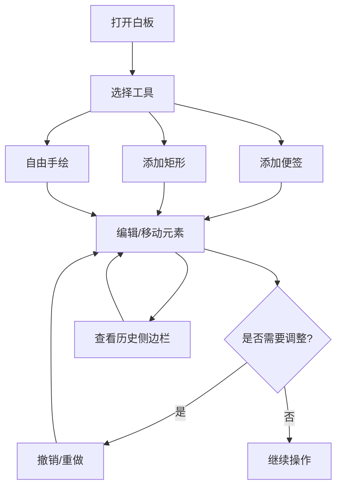

## 1. 产品概述

在线协作白板是一款让团队成员在同一画布上实时协作的工具，支持添加便签、矩形和自由手绘，所有操作实时同步并记录操作历史，支持撤销和重做。
- 解决远程团队协作时缺乏可视化头脑风暴工具的问题
- 面向需要实时协作的产品团队、设计团队和开发团队

## 2. 核心功能

### 2.1 用户角色

| 角色 | 注册方式 | 核心权限 |
|------|----------|----------|
| 团队成员 | 直接访问 | 在白板上添加、编辑、删除元素，浏览操作历史 |

### 2.2 功能模块

1. **白板页面**: 无限滚动画布、元素添加与编辑、拖拽平移与缩放、吸附对齐
2. **工具栏**: 添加便签/矩形/手绘、撤销/重做操作、历史侧边栏开关

### 2.3 页面详情

| 页面名称 | 模块名称 | 功能描述 |
|----------|----------|----------|
| 白板页面 | 画布区域 | 无限滚动白板，背景#F8FAFC，浅灰色网格线#E2E8F0间距40px，初始视口1280x800px |
| 白板页面 | 文本便签 | 黄色背景#FEF08A，圆角8px，宽240px高160px，0.5px #EAB308边框，点击编辑文字，右上角删除按钮18x18px #EF4444圆角50% |
| 白板页面 | 矩形元素 | 可调填充色和边框色，默认填充#DBEAFE边框#3B82F6 |
| 白板页面 | 自由手绘 | 贝塞尔曲线平滑，笔触宽3px颜色#6366F1透明度0.85 |
| 白板页面 | 吸附对齐 | 15px范围内显示1px虚线#10B981吸附线 |
| 白板页面 | 拖拽阴影 | 元素拖拽时半透明阴影偏移x2px y2px模糊4px #00000033 |
| 白板页面 | 平移缩放 | 鼠标拖拽平移，滚轮缩放0.3-3.0，平滑插值0.2秒 |
| 工具栏 | 顶部工具栏 | 固定高度56px背景#FFFFFF底部1px #E2E8F0边框，撤销(Ctrl+Z)/重做(Ctrl+Shift+Z)，添加按钮 |
| 历史侧边栏 | 版本摘要 | 右侧滑入宽280px背景#FFFFFF左侧1px #E2E8F0边框，0.3s ease动画，倒序列出近10个操作 |

## 3. 核心流程

用户打开白板 → 通过工具栏选择添加便签/矩形/手绘 → 在画布上创建元素 → 拖拽移动元素 → 吸附对齐辅助 → 执行撤销/重做 → 查看历史侧边栏

## 4. 用户界面设计

### 4.1 设计风格

- 主色调：#6366F1（靛蓝）和 #3B82F6（蓝色）点缀
- 按钮风格：极简扁平设计，圆角按钮，悬停时2px淡淡光晕
- 字体：系统字体栈，简洁易读
- 布局：顶部工具栏 + 中间画布 + 右侧可滑入历史侧边栏
- 图标风格：简洁线性图标（+号、垃圾桶、四向箭头）

### 4.2 页面设计概览

| 页面名称 | 模块名称 | UI元素 |
|----------|----------|--------|
| 白板页面 | 画布区域 | 浅灰网格背景，白色画布区，拖拽平移时光标变化，缩放时平滑过渡 |
| 白板页面 | 便签元素 | 黄色圆角卡片，悬停阴影增强，删除按钮悬停显示 |
| 白板页面 | 矩形元素 | 蓝色调矩形，选中时边框高亮 |
| 白板页面 | 手绘路径 | 靛蓝半透明曲线，选中时控制点显示 |
| 白板页面 | 吸附线 | 绿色虚线，自动出现消失 |
| 工具栏 | 顶部栏 | 白色背景底边框，图标按钮组，撤销重做灰态/亮态切换 |
| 历史侧边栏 | 侧边栏 | 白色背景左边框，操作类型图标+时间戳列表，滑入动画 |

### 4.3 响应式

- 桌面端优先（最小宽度1024px）
- 视口高度小于700px时底部工具栏自动折行
- 所有可交互元素悬停时加亮2px淡淡光晕，移除时0.2秒恢复
