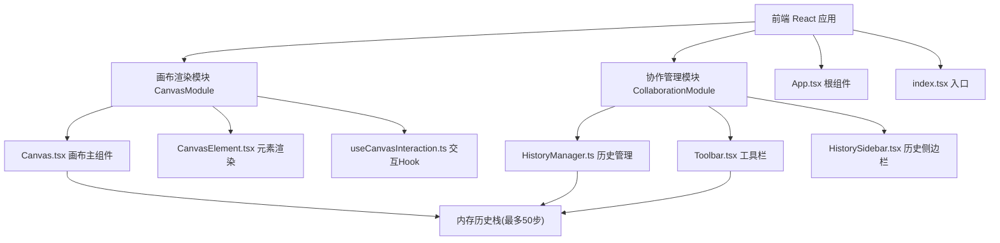
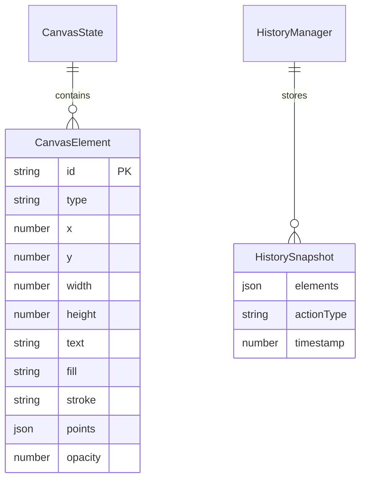

## 1. 架构设计



## 2. 技术说明

- 前端：React@18.2.0 + TypeScript@5.3.3 + Vite@5.0.8
- 初始化工具：vite-init
- 后端：无（纯前端应用）
- 数据库：无（内存存储操作历史）
- 状态管理：使用 Zustand 管理画布状态和元素数据
- 依赖：react@18.2.0、react-dom@18.2.0、typescript@5.3.3、vite@5.0.8、@vitejs/plugin-react@4.2.0、uuid@9.0.0

## 3. 路由定义

| 路由 | 用途 |
|------|------|
| / | 白板主页面，包含画布、工具栏和历史侧边栏 |

## 4. API定义

无后端API，所有操作在前端内存中完成。

### 核心数据类型

```typescript
interface CanvasElement {
  id: string;
  type: 'sticky' | 'rectangle' | 'path';
  x: number;
  y: number;
  width?: number;
  height?: number;
  text?: string;
  fill?: string;
  stroke?: string;
  points?: { x: number; y: number }[];
  opacity?: number;
}

interface HistorySnapshot {
  elements: CanvasElement[];
  actionType: 'add' | 'delete' | 'move' | 'edit';
  timestamp: number;
}

interface CanvasState {
  elements: CanvasElement[];
  offset: { x: number; y: number };
  zoom: number;
  selectedId: string | null;
  dragging: boolean;
}
```

## 5. 服务器架构图

无后端服务。

## 6. 数据模型

### 6.1 数据模型定义



### 6.2 文件结构

```
├── package.json
├── index.html
├── vite.config.js
├── tsconfig.json
├── src/
│   ├── CanvasModule/
│   │   ├── Canvas.tsx          # 画布主组件
│   │   ├── CanvasElement.tsx   # 单个画布元素渲染
│   │   └── useCanvasInteraction.ts  # 交互Hook
│   ├── CollaborationModule/
│   │   ├── HistoryManager.ts   # 历史管理纯函数
│   │   ├── HistorySidebar.tsx  # 侧边栏组件
│   │   └── Toolbar.tsx         # 工具栏组件
│   ├── App.tsx                 # 根组件
│   └── index.tsx               # 应用入口
```
