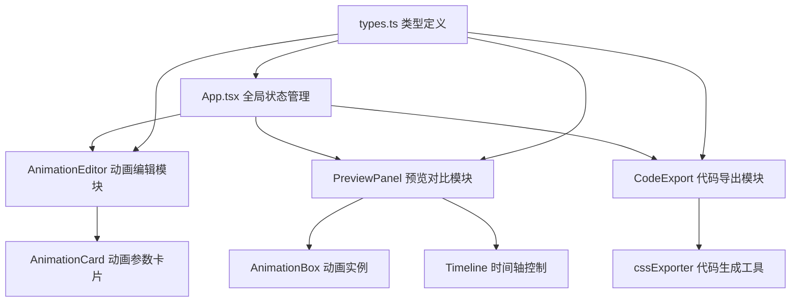

## 1. 架构设计



## 2. 技术描述

- **前端框架**：React@18.2.0 + TypeScript@5.3.3
- **构建工具**：Vite@5.0.8 + @vitejs/plugin-react@4.2.0
- **样式方案**：styled-components@6.1.8（CSS-in-JS）
- **状态管理**：React useState + useCallback（轻量级场景，无需额外状态库）
- **类型定义**：@types/react@18.2.0、@types/react-dom@18.2.0、@types/styled-components@5.1.34

## 3. 目录结构

```
src/
├── main.tsx              # React渲染入口
├── App.tsx               # 主布局组件，全局状态管理
├── types/
│   └── animation.ts      # 动画类型定义
├── modules/
│   ├── editor/
│   │   ├── AnimationEditor.tsx   # 动画编辑区组件
│   │   └── AnimationCard.tsx     # 单个动画参数卡片
│   └── preview/
│       ├── PreviewPanel.tsx      # 预览对比区组件
│       └── AnimationBox.tsx      # 单个动画实例组件
└── utils/
    └── cssExporter.ts    # CSS代码导出工具
```

## 4. 数据模型

### 4.1 动画参数类型定义

```typescript
export type AnimationType = 'translate' | 'rotate' | 'scale' | 'color' | 'bounce';

export type EasingType = 'ease' | 'linear' | 'ease-in' | 'ease-out' | 'ease-in-out' | 'cubic-bezier';

export interface AnimationConfig {
  id: string;
  name: string;
  type: AnimationType;
  duration: number;      // 0.1 - 5s, 步进0.1s
  delay: number;         // 0 - 2s, 步进0.1s
  easing: EasingType;
  cubicBezier?: [number, number, number, number];  // 自定义贝塞尔曲线
}

export interface AnimationInstance {
  id: string;
  config: AnimationConfig;
  isPlaying: boolean;
}

export interface AppState {
  instances: AnimationInstance[];
  currentTime: number;   // 0 - maxDuration
  isPlaying: boolean;
  activeInstanceId: string;
}
```

### 4.2 预设动画类型配置

| 类型 | 描述 | @keyframes 定义 |
|------|------|----------------|
| translate | 平移 | transform: translateX(0) → translateX(100px) |
| rotate | 旋转 | transform: rotate(0deg) → rotate(360deg) |
| scale | 缩放 | transform: scale(1) → scale(1.5) |
| color | 颜色渐变 | background: #8B5CF6 → #3B82F6 |
| bounce | 弹性弹跳 | transform: translateY(0) → translateY(-50px) → 0 |

## 5. 核心技术实现要点

### 5.1 动画控制方案
- 使用CSS `animation-play-state` 控制播放/暂停
- 通过 `animation-delay: -currentTime` 实现时间轴拖拽定位
- 所有实例共享同一时间轴状态，保证同步播放

### 5.2 性能优化策略
- AnimationBox 使用 `React.memo` + `useMemo` 避免不必要重渲染
- 动画属性仅使用 `transform` 和 `opacity`，触发GPU合成层
- 时间轴更新使用 `requestAnimationFrame` 节流

### 5.3 响应式实现
- 使用styled-components的css media query
- 移动端抽屉面板使用CSS transform过渡动画

### 5.4 代码导出功能
- 根据AnimationConfig动态生成@keyframes和animation属性
- 使用正则表达式高亮关键数值（时长、延迟、贝塞尔参数）
- 复制功能使用navigator.clipboard.writeText API
