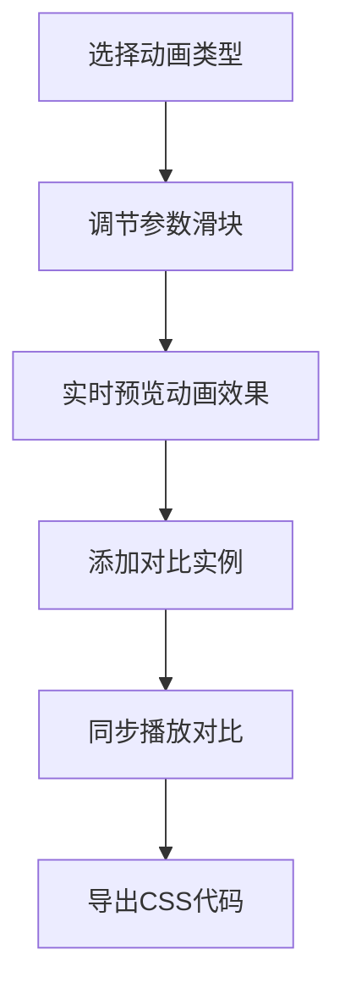

## 1. 产品概述

CSS动画沙盒是一款面向前端开发者的动画调试工具，帮助开发者快速验证和对比不同CSS动画参数组合的视觉效果，解决开发过程中无法直观对比缓动函数、关键帧时长对动画表现影响的痛点。

- **核心价值**：提供可视化的动画参数调节和多实例对比能力，大幅提升CSS动画开发效率
- **目标用户**：前端开发工程师、UI动效设计师

## 2. 核心功能

### 2.1 功能模块

1. **动画编辑模块**：预设动画类型选择、参数实时调节
2. **对比预览模块**：多实例同步播放、时间轴控制
3. **代码导出模块**：CSS代码生成、一键复制

### 2.2 页面详情

| 页面名称 | 模块名称 | 功能描述 |
|---------|----------|----------|
| 主页面 | 动画编辑区 | 折叠卡片展示5种动画类型，每种可独立调节时长、延迟、缓动函数 |
| 主页面 | 对比预览区 | 同时展示最多4个动画实例，同步播放，时间轴拖拽控制 |
| 主页面 | 代码导出面板 | 实时生成CSS代码，高亮关键参数，一键复制 |

## 3. 核心流程

用户选择动画类型 → 调节各项参数 → 预览区实时渲染动画 → 添加对比实例 → 同步播放对比效果 → 导出CSS代码

## 4. 用户界面设计

### 4.1 设计风格
- **主色调**：紫色#8B5CF6 + 蓝色#3B82F6渐变
- **辅助色**：深紫#1E1B4B（标题栏）、浅灰#F3F4F6（背景）
- **按钮样式**：圆角22px胶囊按钮，深色背景白色文字，悬停加深
- **字体**：现代无衬线字体，标题16px粗体，正文14px常规，参数标注12px
- **布局**：左右分栏（编辑区380px固定宽度 + 预览区自适应）
- **交互**：参数变化即时生效，滑块拖拽丝滑流畅

### 4.2 页面设计概览

| 页面名称 | 模块名称 | UI元素 |
|---------|----------|--------|
| 主页面 | 标题栏 | 高56px深紫背景，白色标题文字 |
| 主页面 | 编辑区 | 白色卡片折叠面板，滑块控件，下拉选择器 |
| 主页面 | 预览区 | 灰色背景，120x120px动画元素，参数摘要文字 |
| 主页面 | 时间轴 | 顶部通栏6px高度，渐变进度条，可拖拽 |
| 主页面 | 导出区 | 代码高亮显示块，复制按钮 |

### 4.3 响应式
- **桌面端**（≥900px）：左右分栏布局，编辑区固定380px宽度
- **移动端**（<900px）：编辑区变为顶部抽屉式可折叠面板，预览区占满全屏

### 4.4 性能要求
- 所有动画以60FPS运行
- 参数调节时无卡顿
- 实例切换时流畅过渡
- 使用CSS transforms和opacity属性实现动画以保证硬件加速
