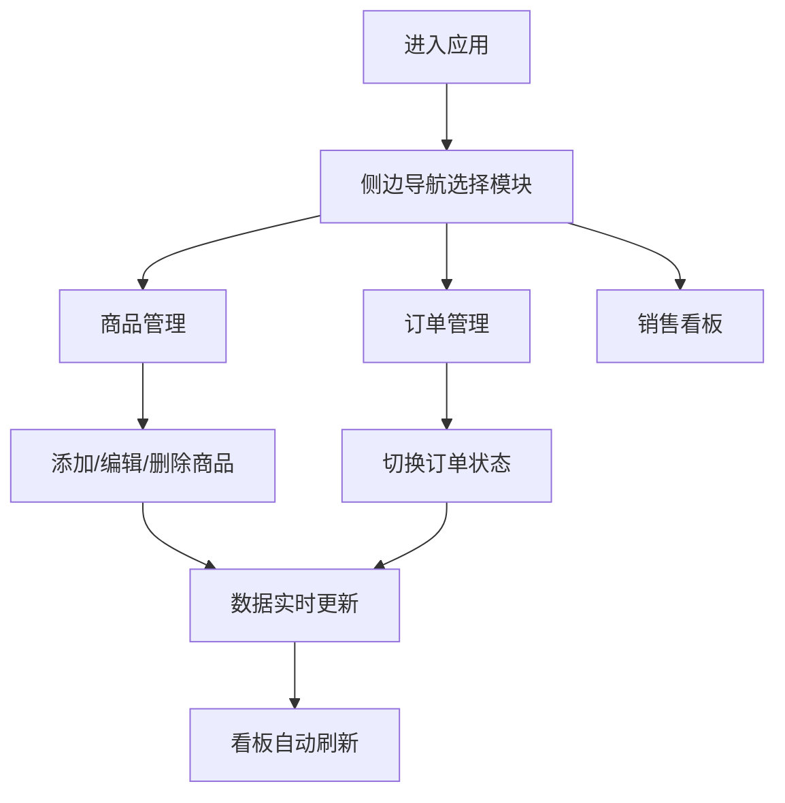

## 1. 产品概述
创意市集摊位管理与销售看板应用，为摊主提供一站式的商品、订单和销售数据管理解决方案。
- 目标用户：创意市集摊主、小型零售商
- 核心价值：简化商品库存管理、订单跟踪流程，提供实时销售数据可视化，辅助经营决策

## 2. 核心功能

### 2.1 用户角色
| 角色 | 注册方式 | 核心权限 |
|------|----------|----------|
| 摊主 | 无需登录，单用户模式 | 商品增删改查、订单管理、查看销售统计 |

### 2.2 功能模块
1. **商品管理模块**：商品卡片展示、添加/编辑/删除商品、搜索与排序
2. **订单管理模块**：订单列表展示、状态流转、筛选与排序
3. **销售看板模块**：统计卡片、近7天销售趋势柱状图

### 2.3 页面详情
| 页面名称 | 模块名称 | 功能描述 |
|----------|----------|----------|
| 商品管理 | 商品卡片网格 | 每行4张卡片，展示缩略图、名称、价格、库存，支持编辑删除 |
| 商品管理 | 搜索与排序栏 | 按名称搜索，按价格/库存升序降序排序 |
| 商品管理 | 商品表单 | 添加/编辑商品（名称、价格、库存、描述、图片URL） |
| 订单管理 | 订单列表 | 每行展示商品缩略图、名称、数量、总价、状态标签 |
| 订单管理 | 状态切换 | 点击状态标签切换（待支付→已支付→发货中→已完成） |
| 订单管理 | 筛选排序 | 按状态筛选，按时间排序（最新在上） |
| 销售看板 | 统计卡片 | 今日销售额、本月订单数、总商品数 |
| 销售看板 | 销售趋势图 | 近7天销售额柱状图 |

## 3. 核心流程
摊主进入应用后，通过左侧导航栏在三个模块间切换。在商品管理中维护商品信息，订单管理中处理订单状态流转，销售看板中查看经营数据。所有数据变化实时同步刷新。

## 4. 用户界面设计

### 4.1 设计风格
- 主色调：靛蓝色 #6366F1、翠绿色 #10B981
- 按钮风格：圆角胶囊形，主按钮靛蓝渐变，悬停上浮
- 字体：Inter 或系统无衬线字体，标题 32px #111827，辅助文字 14px #6B7280
- 布局风格：左右分栏，卡片式内容展示，统一圆角 12-16px，柔和阴影
- 图标风格：lucide-react 线性图标

### 4.2 页面设计概览
| 页面名称 | 模块名称 | UI 元素 |
|----------|----------|---------|
| 商品管理 | 商品卡片 | 240x340px 圆角16px，悬停上浮8px，0.3s 过渡动画 |
| 订单管理 | 订单行 | 高80px，状态标签渐变色切换 0.4s |
| 销售看板 | 统计卡片 | 宽33%高120px渐变背景，底部向上弹出淡入 0.5s |
| 销售看板 | 柱状图 | 柱子从底部升起动画 0.6s |
| 全局 | 侧边栏 | 宽240px深灰#1F2937，导航项悬停左移4px 0.2s |

### 4.3 响应式设计
- 桌面端：左右分栏（侧边栏 240px + 内容区自适应）
- 移动端（<768px）：侧边栏收起为顶部 64px 导航条，导航项水平排列
- 触控优化：增大点击区域，支持手势滑动

### 4.4 动画与交互
- 页面加载：各模块 0.2s 间隔依次淡入
- 卡片悬停：上浮 8px 加深阴影，0.3s ease-out
- 状态切换：背景色 0.4s 渐变过渡
- 导航悬停：左移 4px，背景色变化，0.2s
- 性能目标：列表渲染 <500ms，搜索筛选 <200ms，动画 60FPS
