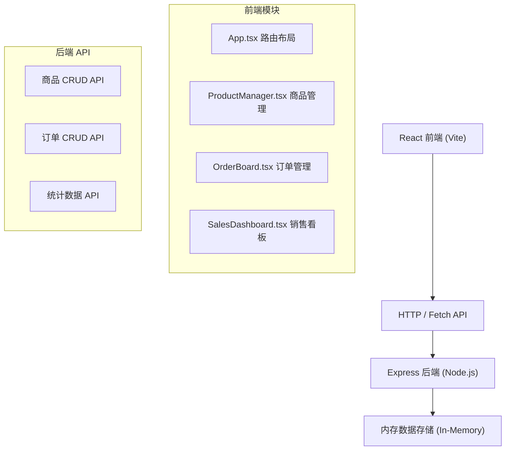
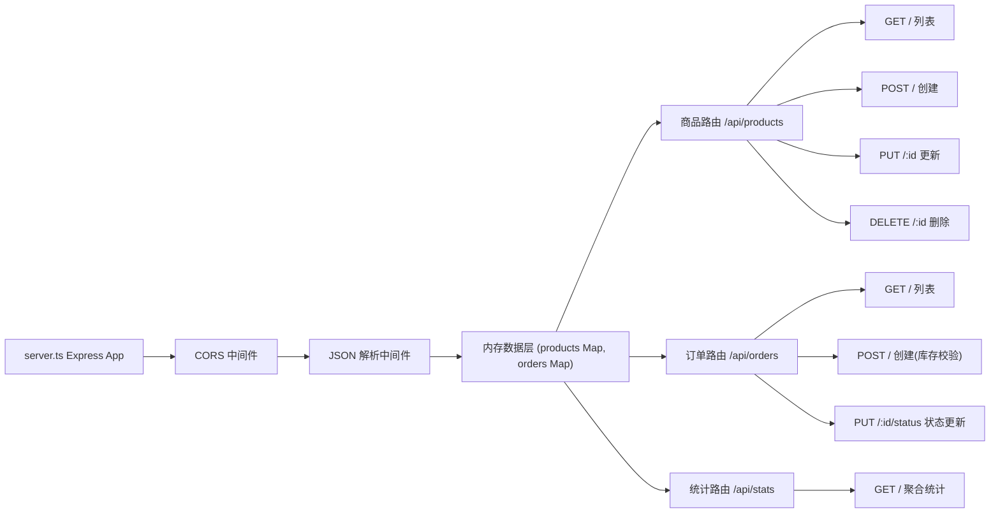
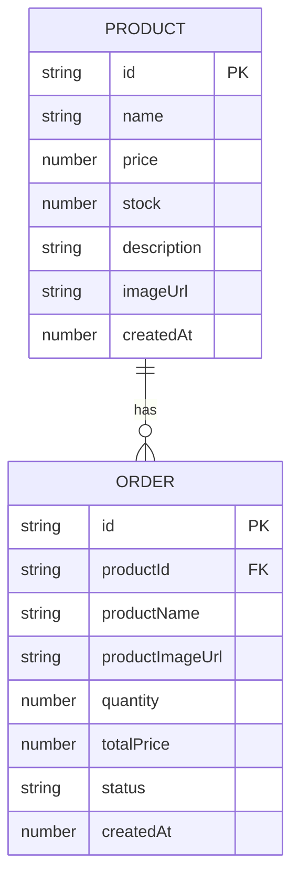

## 1. 架构设计



## 2. 技术说明

- 前端：React 18.2.0 + TypeScript 5.3.3 + Vite 5.0.8
- 后端：Express 4.18.2 + Node.js
- 数据存储：内存存储（Map/Array）
- 样式方案：CSS-in-JS / 内联样式（无需 Tailwind）
- HTTP 客户端：原生 fetch API
- 构建工具：Vite 5.0.8，配置 @ 路径别名指向 src
- 图标库：lucide-react

## 3. 路由定义

| 路由 | 用途 |
|------|------|
| /products | 商品管理页面 |
| /orders | 订单管理页面 |
| /dashboard | 销售看板页面 |

## 4. API 定义

### 类型定义
```typescript
interface Product {
  id: string;
  name: string;
  price: number;
  stock: number;
  description: string;
  imageUrl: string;
  createdAt: number;
}

type OrderStatus = 'pending' | 'paid' | 'shipping' | 'completed';

interface Order {
  id: string;
  productId: string;
  productName: string;
  productImageUrl: string;
  quantity: number;
  totalPrice: number;
  status: OrderStatus;
  createdAt: number;
}

interface SalesStats {
  todaySales: number;
  monthlyOrders: number;
  totalProducts: number;
  dailySales: { date: string; amount: number }[];
}
```

### API 端点
| 方法 | 路径 | 描述 |
|------|------|------|
| GET | /api/products | 获取所有商品 |
| POST | /api/products | 创建商品 |
| PUT | /api/products/:id | 更新商品 |
| DELETE | /api/products/:id | 删除商品 |
| GET | /api/orders | 获取所有订单 |
| POST | /api/orders | 创建订单（校验库存） |
| PUT | /api/orders/:id/status | 更新订单状态 |
| GET | /api/stats | 获取销售统计数据 |

## 5. 服务器架构图



## 6. 数据模型

### 6.1 数据模型定义



### 6.2 初始数据
- 预置 5-8 个示例商品（手工艺品、创意周边等）
- 预置 6-10 个不同状态的示例订单
- 预置近 7 天的销售数据用于柱状图展示

## 7. 前端状态管理

- 使用 React useState/useEffect 管理组件状态
- 数据变化后通过轮询（2s 间隔）或操作后立即刷新同步后端数据
- 每个模块独立维护自己的数据状态
