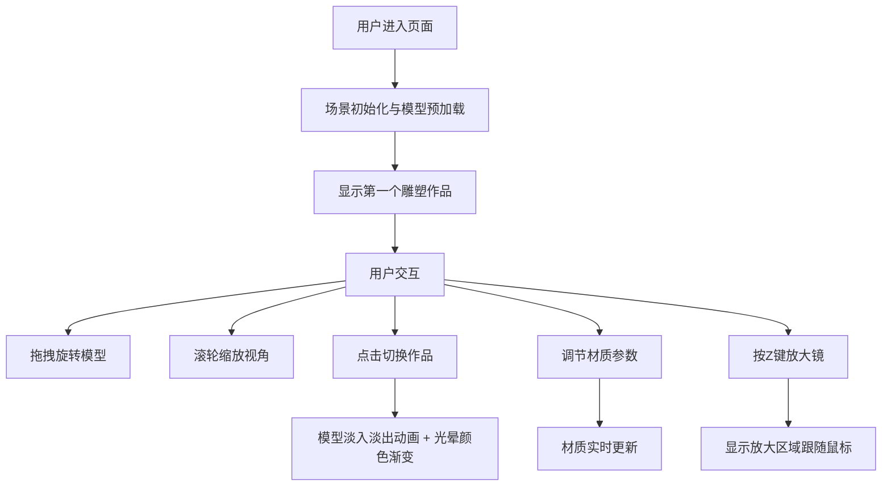

## 1. 产品概述

三维雕塑作品展示台是一个基于WebGL的沉浸式3D艺术欣赏平台，解决艺术爱好者和策展人在线上无法从任意角度欣赏雕塑作品细节的痛点。通过Three.js实现高质量3D渲染，让用户能够自由旋转、缩放雕塑作品，调节材质光照，并通过放大镜模式观察作品表面纹理细节。

- **目标用户**：艺术爱好者、策展人、艺术品收藏家、艺术教育工作者
- **核心价值**：打破传统图片展示的局限性，提供沉浸式的3D雕塑欣赏体验

## 2. 核心功能

### 2.1 功能模块

1. **作品加载与切换模块**：预载3个不同风格雕塑模型，通过底部导航栏平滑切换，伴随光晕颜色渐变
2. **交互控制模块**：鼠标拖拽旋转、滚轮缩放，带阻尼效果的流畅交互
3. **材质与光照动态调整模块**：右侧弹出面板，实时调节金属度、粗糙度、环境光强度
4. **细节放大镜模式**：Z键触发局部放大，2倍放大倍率显示表面纹理细节

### 2.2 页面详情

| 页面名称 | 模块名称 | 功能描述 |
|-----------|-------------|---------------------|
| 主展示页面 | 3D渲染画布 | 全屏3D场景，径向渐变背景，雕塑模型居中展示，地面投影阴影 |
| 主展示页面 | 底部导航栏 | 80px半透明导航，显示作品名称，左右箭头切换作品，平滑过渡动画 |
| 主展示页面 | 右侧控制面板 | 280px滑出式面板，三个参数滑块实时调节材质与光照 |
| 主展示页面 | 放大镜组件 | Z键激活，跟随鼠标的200px圆形放大区域，2倍放大倍率 |

## 3. 核心流程

## 4. 用户界面设计

### 4.1 设计风格

- **主色调**：深蓝色 #0A0A23（背景）、#16213E（UI元素背景）、#4A00E0（强调色）
- **文字颜色**：#E0E0E0（主要文字）、#FFFFFF（高亮文字）、#9CA3AF（次要文字）
- **作品光晕色**：几何抽象冷蓝#4A90D9、人像暖金#E6A817、动物自然绿#4CAF50
- **字体**：-apple-system, BlinkMacSystemFont, 'Segoe UI', Roboto, sans-serif
- **按钮风格**：圆形按钮，圆角50%，悬停亮度提升10%，点击缩小到0.95倍
- **整体风格**：深色沉浸式主题，半透明毛玻璃效果UI元素悬浮于3D画布之上

### 4.2 页面设计概述

| 页面名称 | 模块名称 | UI Elements |
|-----------|-------------|-------------|
| 主展示页面 | 3D场景 | 径向渐变背景#0A0A23到#1A0A2E，地面椭圆阴影50%透明度 |
| 主展示页面 | 底部导航栏 | 80px高度半透明#1A1A2E背景，中央作品名称18px#E0E0E0，左右32x32px圆形箭头按钮#16213E |
| 主展示页面 | 控制面板 | 280px宽，20px圆角#16213E背景，1px发光边框#4A00E080，滑入动画0.3秒ease-out |
| 主展示页面 | 滑块控件 | 轨道6px高圆角3px#4A00E0，滑块20x20px圆形#FFFFFF，12px标签#9CA3AF，16px粗体数值#FFFFFF |
| 主展示页面 | 放大镜 | 200px直径圆形，2px白色边框，2倍放大倍率 |

### 4.3 响应式设计

- **桌面端优先**：全屏沉浸式布局，针对鼠标键盘交互优化
- **交互提示**：顶部显示操作提示（拖拽旋转·滚轮缩放·按Z键放大镜）
- **悬浮UI**：所有控制面板悬浮于3D画布之上，不遮挡核心视野

### 4.4 3D场景设计

- **环境光照**：AmbientLight + DirectionalLight + PointLight组合，支持动态强度调节
- **背景**：Canvas绘制径向渐变#0A0A23到#1A0A2E
- **地面**：接收阴影的平面，投射椭圆形半透明阴影
- **光晕效果**：PointLight随作品切换颜色渐变，营造氛围感
- **相机**：PerspectiveCamera，fov 60度，初始距离适配模型大小
- **模型**：程序化生成3个风格化雕塑模型（几何抽象、人像、动物），使用MeshStandardMaterial
- **后处理**：无额外后处理以保证60FPS性能
- **性能**：单模型面数控制在1万以内，使用BufferGeometry优化渲染

