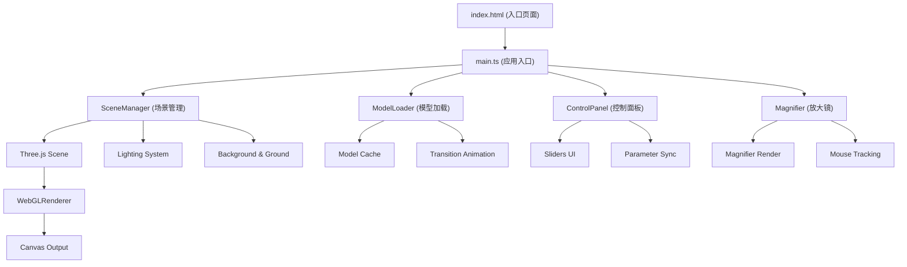

## 1. 架构设计



## 2. 技术说明

- **前端框架**：TypeScript 5.3.3 + Three.js 0.160.0 + Vite 5.0.8
- **构建工具**：Vite 5.0.8，提供快速开发服务器和优化构建
- **3D渲染**：Three.js 0.160.0，原生WebGL渲染，无React封装以保证性能
- **模型生成**：程序化生成雕塑模型（无需外部资源加载），使用Three.js内置几何体组合
- **材质系统**：MeshStandardMaterial，支持金属度、粗糙度参数实时调节
- **动画系统**：requestAnimationFrame驱动，使用lerp插值实现平滑过渡
- **无后端**：纯前端应用，无需服务器支持

## 3. 模块职责划分

### 3.1 文件结构

| 文件 | 职责 |
|------|------|
| `src/main.ts` | 应用入口，初始化场景、相机、渲染器，协调各模块，负责动画循环和事件监听 |
| `src/sceneManager.ts` | 场景管理：创建并维护3D场景（灯光、背景、地面），提供API供其他模块修改光照和环境配置 |
| `src/modelLoader.ts` | 模型加载与切换：使用程序化方式生成3个预设雕塑模型，管理模型缓存和切换动画 |
| `src/controlPanel.ts` | 控制面板UI：创建并管理右侧材质/光照调节面板，包含所有滑块和标签，与sceneManager通信 |
| `src/magnifier.ts` | 放大镜模式：实现Z键触发的局部放大效果，渲染到独立canvas覆盖在主渲染画面之上 |

### 3.2 核心类与接口

```typescript
// SceneManager
class SceneManager {
  scene: THREE.Scene;
  ambientLight: THREE.AmbientLight;
  directionalLight: THREE.DirectionalLight;
  pointLight: THREE.PointLight;
  ground: THREE.Mesh;
  
  constructor(container: HTMLElement);
  setAmbientIntensity(value: number): void;
  setPointLightColor(color: number): void;
  getScene(): THREE.Scene;
}

// ModelLoader
class ModelLoader {
  currentModel: THREE.Group | null;
  modelCache: Map<string, THREE.Group>;
  
  constructor(scene: THREE.Scene);
  loadModels(): Promise<void>;
  switchModel(index: number): Promise<void>;
  updateMaterial(metalness: number, roughness: number): void;
}

// ControlPanel
class ControlPanel {
  constructor(sceneManager: SceneManager, modelLoader: ModelLoader);
  onMetalnessChange: (value: number) => void;
  onRoughnessChange: (value: number) => void;
  onAmbientChange: (value: number) => void;
}

// Magnifier
class Magnifier {
  active: boolean;
  constructor(renderer: THREE.WebGLRenderer, camera: THREE.PerspectiveCamera, scene: THREE.Scene);
  activate(): void;
  deactivate(): void;
  updatePosition(x: number, y: number): void;
  render(): void;
}
```

## 4. 性能优化策略

### 4.1 渲染性能

- **模型缓存**：预先生成所有3个模型并存入缓存，切换时仅显隐切换
- **几何体优化**：使用BufferGeometry，合并重复几何体，面数控制在1万以内
- **材质复用**：所有模型共享材质实例，参数修改时批量更新
- **阴影优化**：仅地面接收阴影，模型不投射阴影以节省性能
- **像素比限制**：设置renderer.setPixelRatio(Math.min(window.devicePixelRatio, 2))

### 4.2 交互响应

- **阻尼效果**：使用lerp插值实现0.2秒阻尼旋转，0.3秒平滑缩放
- **动画帧率**：固定60FPS更新，使用performance.now()计算delta时间
- **事件节流**：mousemove事件使用requestAnimationFrame节流

### 4.3 加载性能

- **程序化模型**：无需加载外部GLTF资源，使用Three.js内置几何体快速生成
- **并行初始化**：场景、灯光、模型同时初始化，总加载时间控制在2秒内
- **无额外依赖**：仅依赖three和typescript，减少加载体积

## 5. 动画实现方案

### 5.1 模型切换动画

```typescript
// 淡入淡出动画 0.6秒 ease-in-out
const animateTransition = async (outModel: THREE.Group, inModel: THREE.Group) => {
  const duration = 600;
  const startTime = performance.now();
  
  const animate = () => {
    const elapsed = performance.now() - startTime;
    const progress = Math.min(elapsed / duration, 1);
    const eased = easeInOut(progress);
    
    outModel.traverse((child) => {
      if (child instanceof THREE.Mesh) {
        child.material.opacity = 1 - eased;
      }
    });
    
    inModel.traverse((child) => {
      if (child instanceof THREE.Mesh) {
        child.material.opacity = eased;
      }
    });
    
    if (progress < 1) requestAnimationFrame(animate);
  };
  
  animate();
};
```

### 5.2 光晕颜色渐变

```typescript
// 光晕颜色平滑过渡
const lerpColor = (from: THREE.Color, to: THREE.Color, t: number) => {
  return new THREE.Color(
    from.r + (to.r - from.r) * t,
    from.g + (to.g - from.g) * t,
    from.b + (to.b - from.b) * t
  );
};
```

## 6. 放大镜实现方案

使用离屏渲染目标（WebGLRenderTarget）实现局部放大：

1. 创建200x200像素的WebGLRenderTarget
2. 放大相机FOV或移动相机靠近模型
3. 将场景渲染到离屏目标
4. 将渲染结果绘制到放大镜canvas
5. 使用CSS clip-path或border-radius实现圆形裁剪

