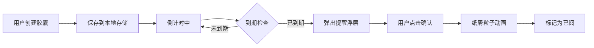

## 1. 产品概述

时间胶囊与回忆唤醒应用，允许用户给未来的自己写一封包含文字、图片和心情的备忘，系统会在设定日期自动提醒用户回看。

- 核心价值：记录当下的心情与思绪，在未来某个时刻唤醒珍贵回忆
- 目标用户：喜欢记录生活、期待与未来自己对话的用户
- 产品定位：温暖、感性、有仪式感的个人时间胶囊工具

## 2. 核心功能

### 2.1 用户角色

| 角色 | 注册方式 | 核心权限 |
|------|----------|----------|
| 普通用户 | 无需注册，本地存储 | 创建胶囊、查看时间线、接收到期提醒 |

### 2.2 功能模块

1. **胶囊创建模块**：目标日期设置、标题正文编辑、图片URL上传、心情表情选择
2. **时间线展示模块**：瀑布流卡片展示、倒计时显示、响应式布局
3. **回忆唤醒模块**：定时检查到期胶囊、弹窗展示、粒子动画效果
4. **侧边栏模块**：最近五条胶囊摘要、倒计时概览

### 2.3 页面详情

| 页面名称 | 模块名称 | 功能描述 |
|----------|----------|----------|
| 主页面 | 胶囊创建表单 | 日期选择器、标题输入、正文编辑（500字限制+进度条）、图片URL输入+预览、心情表情五选一 |
| 主页面 | 左侧边栏 | 最近创建的五条胶囊摘要、倒计时天数显示 |
| 主页面 | 时间线瀑布流 | 全部胶囊卡片瀑布流展示、悬停上浮效果、到期状态指示 |
| 主页面 | 到期弹窗 | 居中浮层展示胶囊内容、心情表情动画、确认已阅按钮、纸屑粒子效果 |

## 3. 核心流程

用户创建时间胶囊 → 系统保存并开始倒计时 → 定时检查到期胶囊 → 到期时弹出浮层提醒 → 用户确认后触发粒子动画 → 胶囊标记为已读

## 4. 用户界面设计

### 4.1 设计风格

- **主色调**：深色模式 `#111827` 背景，面板 `#1F2937`
- **强调色**：紫色渐变 `#7C3AED` → `#6D28D9`
- **心情色**：开心 `#FBBF24`、平静 `#60A5FA`、伤感 `#818CF8`、愤怒 `#F87171`、疲惫 `#A78BFA`
- **卡片风格**：白色背景、圆角 12px、`#E5E7EB` 边框
- **按钮风格**：圆角 22px、紫色渐变、悬停反馈
- **字体**：现代无衬线字体，清晰层级
- **整体氛围**：温暖包裹感、仪式感、静谧深邃

### 4.2 页面设计概览

| 页面名称 | 模块名称 | UI 元素 |
|----------|----------|---------|
| 主页面 | 胶囊创建表单 | 日期选择器、标题输入框、正文区域（字数统计+进度条）、图片URL输入+缩略图、心情表情选择器 |
| 主页面 | 左侧边栏 | 240px 宽、五条胶囊摘要、倒计时数字 |
| 主页面 | 瀑布流时间线 | 280px 宽卡片、圆角 12px、悬停上浮 6px、倒计时大字 |
| 主页面 | 到期弹窗 | 500×400px、圆角 24px、渐变边框、心情表情缩放动画、确认按钮 |

### 4.3 响应式

- **≥1024px**：三列瀑布流 + 左侧边栏（240px）
- **768-1023px**：两列瀑布流 + 左侧边栏
- **<768px**：单列瀑布流，隐藏左侧边栏

### 4.4 动效细节

- 心情表情选中：放大 1.2 倍 + 1px `#1F2937` 边框 + 0.15s 动画
- 卡片悬停：上浮 6px + 阴影加深 + 0.25s ease-out
- 到期文字：红色 `#DC2626` + 脉冲动画 1 秒
- 弹窗关闭：0.5s fadeOut
- 纸屑粒子：2 秒彩色粒子散落动画
- 心情表情弹窗：1.1 倍 ↔ 1.0 倍缩放，周期 0.5 秒
