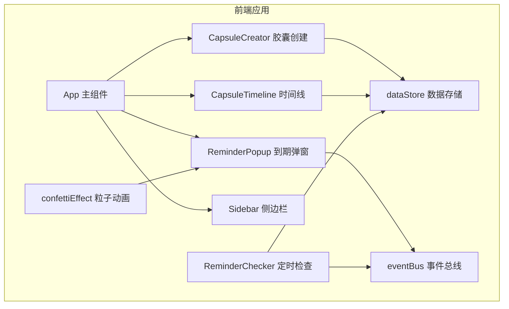

## 1. 架构设计



## 2. 技术选型

- **前端框架**：React@18.2.0 + TypeScript@5.3.3
- **构建工具**：Vite@5.0.8 + @vitejs/plugin-react@4.2.0
- **状态管理**：内存数据存储 (dataStore) + 事件总线 (eventBus)
- **样式方案**：原生 CSS + CSS Modules，使用 CSS 变量管理主题
- **动画方案**：CSS 动画 + 原生 JS 粒子效果

## 3. 目录结构

```
src/
├── modules/
│   ├── capsuleManager/
│   │   ├── CapsuleCreator.tsx    # 胶囊创建表单组件
│   │   └── CapsuleTimeline.tsx   # 时间线瀑布流组件
│   └── reminderEngine/
│       ├── ReminderChecker.ts    # 定时检查模块
│       └── ReminderPopup.tsx     # 到期弹窗组件
├── shared/
│   ├── dataStore.ts              # 内存数据存储
│   └── eventBus.ts               # 事件总线
├── utils/
│   └── confettiEffect.ts         # 粒子动画工具
├── App.tsx                       # 主应用组件
├── main.tsx                      # 入口文件
└── index.css                     # 全局样式
```

## 4. 数据模型

### 4.1 胶囊数据结构

```typescript
interface Capsule {
  id: string;
  title: string;
  content: string;
  imageUrl: string;
  mood: MoodType;
  targetDate: string; // ISO date string
  createdAt: string;
  isOpened: boolean;
  isNotified: boolean;
}

type MoodType = 'happy' | 'calm' | 'sad' | 'angry' | 'tired';
```

### 4.2 心情配置

| 心情 | 颜色 | Emoji |
|------|------|-------|
| happy | #FBBF24 | 😊 |
| calm | #60A5FA | 😌 |
| sad | #818CF8 | 😢 |
| angry | #F87171 | 😠 |
| tired | #A78BFA | 😴 |

## 5. 核心模块说明

### 5.1 dataStore 数据存储

- 内存存储所有胶囊数据
- 提供 CRUD 方法：createCapsule、getAllCapsules、getCapsuleById、updateCapsule、deleteCapsule
- 提供到期检查方法：getExpiredCapsules（返回未通知且已到期的胶囊）
- 提供最近胶囊查询：getRecentCapsules(limit)

### 5.2 eventBus 事件总线

- 简易发布订阅模式
- 支持事件：`capsule-expired`（胶囊到期）
- 方法：on、off、emit

### 5.3 ReminderChecker 定时检查

- 每 10 秒扫描一次所有胶囊
- 检查是否有已到期但未通知的胶囊
- 到期时通过 eventBus 发送 `capsule-expired` 事件
- 标记已通知的胶囊避免重复提醒

### 5.4 ReminderPopup 弹窗组件

- 监听 eventBus 的 `capsule-expired` 事件
- 屏幕中央弹出浮层展示胶囊内容
- 底部确认已阅按钮
- 关闭时触发 confetti 粒子动画
- fadeOut 消失动画

### 5.5 CapsuleCreator 创建组件

- 表单包含：目标日期、标题、正文、图片URL、心情选择
- 正文 500 字限制，底部实时字数统计 + 进度条
- 超 400 字后边框变橙色并闪烁
- 图片 URL 输入，下方 128x128 缩略图预览
- 心情五选一，选中放大 1.2 倍带边框动画

### 5.6 CapsuleTimeline 时间线组件

- 瀑布流布局展示所有胶囊
- 卡片宽 280px、圆角 12px、白色背景
- 底部显示距离打开日期的倒计时天数
- 到期时文字变红色并脉冲动画
- 响应式：三列/两列/单列
- 卡片悬停上浮 6px + 阴影加深

### 5.7 confettiEffect 粒子动画

- 接收 DOM 容器参数
- 生成彩色纸屑粒子散落效果
- 动画持续 2 秒
- 使用 requestAnimationFrame 保证流畅

## 6. 性能要求

- 首次渲染 50 个胶囊卡片 ≤ 800ms
- 滚动帧率稳定 ≥ 55fps
- 使用 CSS transform 和 opacity 实现动画，避免重排重绘
- 瀑布流布局使用 CSS columns 或 flex 实现，避免复杂 JS 计算

## 7. 响应式断点

| 断点 | 布局 |
|------|------|
| ≥1024px | 三列瀑布流 + 侧边栏（240px） |
| 768-1023px | 两列瀑布流 + 侧边栏 |
| <768px | 单列瀑布流，隐藏侧边栏 |
