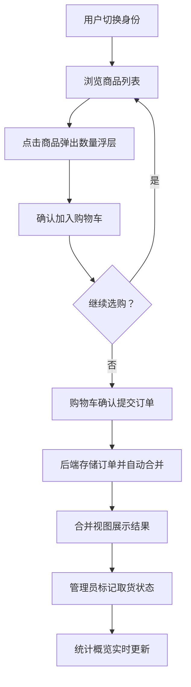

## 1. 产品概述

社区团购订单管理与合并工具，面向本地社区团购组织者，解决微信群里手动统计商品订购、合并订单、计算总价和通知取货的低效问题。目标用户为社区团购组织者及参与团购的社区居民，核心价值是将繁琐的手工统计流程自动化，提升团购管理效率。

## 2. 核心功能

### 2.1 用户角色

| 角色 | 说明 | 核心权限 |
|------|------|----------|
| 模拟用户 | 预设张三、李四、王五 | 浏览商品、下单、查看个人订单 |
| 管理员 | 组织者身份 | 查看合并视图、标记取货状态、添加/管理商品 |

### 2.2 功能模块

1. **商品目录管理页**：商品卡片网格展示、管理员添加商品/调整库存
2. **购物车与下单页**：用户浏览商品、添加购物车、提交订单
3. **订单合并视图页**：按商品合并所有用户订单、取货状态管理、过滤
4. **数据统计概览**：总订单数、总商品种类、总金额、取货进度

### 2.3 页面详情

| 页面名称 | 模块名称 | 功能描述 |
|----------|----------|----------|
| 主页面 | 用户切换栏 | 顶部下拉框切换模拟用户（张三/李四/王五） |
| 主页面-左栏 | 购物车面板 | 显示当前用户已选商品列表、数量修改、移除、提交订单 |
| 主页面-中栏 | 商品网格 | 商品卡片展示（名称、单价、库存）、点击弹出数量选择浮层 |
| 主页面-右栏 | 合并视图面板 | 按商品合并的订单表格、取货状态标记、按状态过滤 |
| 主页面-底部 | 统计概览栏 | 总订单数、总商品种类、总金额、取货完成进度条 |
| 商品管理浮层 | 添加商品表单 | 管理员可输入名称、单价、库存添加新商品 |

## 3. 核心流程

用户切换身份 → 浏览商品列表 → 点击商品选择数量加入购物车 → 购物车确认后提交订单 → 后端按商品ID合并所有用户订单 → 合并视图展示合并结果 → 管理员标记取货状态 → 统计栏实时更新

## 4. 用户界面设计

### 4.1 设计风格

- 主背景色：暖白 #FFFBEB，营造社区温馨氛围
- 强调色：橙棕色 #D97706，用于按钮、卡片底部色条等
- 成功色：#10B981（取货完成、库存充足指示）
- 警告色：#EF4444（库存不足闪烁提示）
- 按钮风格：圆角8px，悬停缩放1.05+背景色加深0.2s
- 字体：Noto Sans SC（中文友好）+ DM Sans（数字展示）
- 布局风格：左中右三栏布局，卡片式商品展示

### 4.2 页面设计概览

| 页面名称 | 模块名称 | UI元素 |
|----------|----------|--------|
| 主页面 | 顶部导航栏 | 用户切换下拉框、管理员商品管理按钮、暖白背景 |
| 主页面-左栏 | 购物车面板 | 宽300px背景#FEF3C7圆角12px阴影、商品列表、提交按钮 |
| 主页面-中栏 | 商品卡片 | 宽200px高280px圆角16px白底、底部6px#D97706色条、悬停抬起6px加深阴影0.3s |
| 主页面-中栏 | 库存指示 | 右下角绿点#10B981(充足)/红点#EF4444闪烁(≤5件) |
| 主页面-右栏 | 合并视图面板 | 宽400px背景#FFFBEB、表格行高48px、偶数行#FEF9C3、取货按钮#D97706圆角8px |
| 主页面-底部 | 统计概览栏 | 四项统计数字+进度条#10B981、数字变化淡入0.3s |
| 浮层 | 数量选择 | 背景#FFFFFF圆角16px内边距24px、半透明遮罩#00000033 |
| 浮层 | 商品管理 | 表单输入名称/单价/库存、添加按钮 |

### 4.3 响应式适配

- 桌面优先设计，三栏布局（左300px + 中自适应 + 右400px）
- 屏幕宽度 < 1024px 时左右面板转为上下堆叠
- 商品网格自适应列数，最小列宽200px

### 4.4 3D场景指引

不适用
