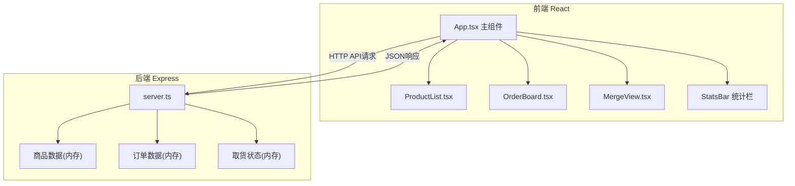

## 1. 架构设计



## 2. 技术说明

- 前端：React@18.2.0 + TypeScript@5.3.3 + Vite@5.0.8
- 构建工具：Vite@5.0.8 + @vitejs/plugin-react@4.2.0
- 后端：Express@4.18.2 + TypeScript
- 数据库：无，数据存储在内存中
- 状态管理：React useState/useReducer（组件内状态）+ fetch API调用
- 跨域：cors@2.8.5
- ID生成：uuid@9.0.0

## 3. 路由定义

| 路由 | 用途 |
|------|------|
| / | 主页面，包含商品列表、购物车、合并视图、统计栏 |

注：本应用为单页面应用，通过组件切换和状态管理实现多视图，无需前端路由。

## 4. API定义

### 4.1 TypeScript类型定义

```typescript
interface Product {
  id: string;
  name: string;
  price: number;
  stock: number;
}

interface OrderItem {
  productId: string;
  productName: string;
  quantity: number;
  price: number;
}

interface Order {
  id: string;
  userId: string;
  userName: string;
  items: OrderItem[];
  createdAt: string;
}

interface MergedItem {
  productId: string;
  productName: string;
  totalQuantity: number;
  totalAmount: number;
  buyers: { userId: string; userName: string; quantity: number }[];
  pickupStatus: { [userId: string]: { picked: boolean; pickedAt?: string } };
}
```

### 4.2 API端点

| 方法 | 路径 | 请求体 | 响应 | 说明 |
|------|------|--------|------|------|
| GET | /api/products | - | Product[] | 获取商品列表 |
| POST | /api/products | { name, price, stock } | Product | 添加新商品 |
| PATCH | /api/products/:id | { stock? } | Product | 更新商品库存 |
| POST | /api/orders | { userId, userName, items } | Order | 提交订单 |
| GET | /api/orders?userId=xxx | - | Order[] | 获取用户订单 |
| DELETE | /api/orders/:id | - | { success } | 取消订单 |
| PATCH | /api/orders/:id | { items } | Order | 修改订单 |
| GET | /api/merged-orders | - | MergedItem[] | 获取合并订单列表 |
| PATCH | /api/merged-orders/:productId/pickup | { userId, picked } | MergedItem | 更新取货状态 |

## 5. 服务端架构图


- 路由处理：Express路由分发HTTP请求
- 业务逻辑：订单创建、合并计算、取货状态管理
- 内存数据存储：products数组、orders数组、pickupStatus映射

## 6. 数据模型

### 6.1 数据模型定义

```mermaid
erDiagram
    Product {
        string id PK
        string name
        number price
        number stock
    }
    Order {
        string id PK
        string userId FK
        string userName
        string createdAt
    }
    OrderItem {
        string productId FK
        string productName
        number quantity
        number price
    }
    MergedItem {
        string productId PK
        string productName
        number totalQuantity
        number totalAmount
    }
    Order ||--o{ OrderItem : contains
    Product ||--o{ OrderItem : references
    MergedItem ||--o{ OrderItem : aggregates
```



### 6.2 初始化数据

预置8种商品（水果、零食、日用品等）：

| 商品名 | 单价(元) | 库存 |
|--------|----------|------|
| 红富士苹果 | 5.80 | 50 |
| 云南香蕉 | 3.50 | 40 |
| 坚果混合装 | 28.00 | 20 |
| 手工饼干 | 15.00 | 30 |
| 抽纸6包装 | 18.50 | 25 |
| 洗洁精 | 12.00 | 35 |
| 有机鸡蛋 | 22.00 | 15 |
| 全麦面包 | 8.50 | 20 |
