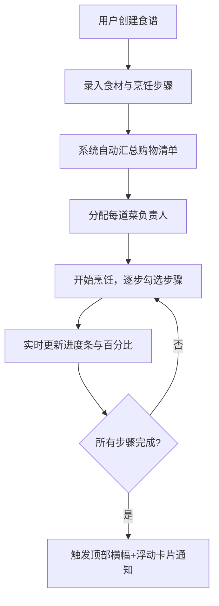

## 1. 产品概述

多人协作食谱烹饪应用，解决家庭聚餐或朋友聚会时大家分工做菜时的协作问题：各忘各的步骤、食材买重或漏买、不知道每道菜做到哪一步。

- 主要用途：管理多人协作的烹饪项目，自动汇总购物清单，实时追踪每道菜的烹饪进度
- 目标用户：家庭主妇/主夫、聚会组织者、烹饪爱好者群体

## 2. 核心功能

### 2.1 功能模块

1. **食谱管理模块**：创建/编辑食谱（菜名、食材清单、烹饪步骤），卡片式展示
2. **购物清单模块**：自动汇总所有食谱所需食材，支持去重、累加数量、勾选已购、导出
3. **协作进度模块**：为每道菜分配负责人，实时显示烹饪进度
4. **实时通知模块**：菜品完成时的横幅通知与浮动提示卡片

### 2.3 页面详情

| 页面名称 | 模块名称 | 功能描述 |
|---------|---------|----------|
| 主页面 | 食谱列表区 | 左侧30%区域，展示所有食谱卡片（280x220px圆角12px），支持编辑删除，点击进入详情 |
| 主页面 | 购物清单区 | 右侧上方，表格展示汇总食材，支持勾选已购、导出纯文本到剪贴板 |
| 主页面 | 进度面板区 | 右侧下方，每道菜显示负责人头像、姓名输入框、步骤进度条和百分比 |
| 食谱详情浮层 | 步骤详情 | 展示完整烹饪步骤，24x24px勾选框，已完成步骤显示实际用时与预计用时进度条 |
| 通知系统 | 完成横幅 | 菜品全部完成时顶部56px绿色横幅，3.5秒后淡出 |
| 通知系统 | 浮动提示卡 | 右下角320px白色卡片，带关闭按钮，显示灵感提示 |

## 3. 核心流程

用户创建食谱 → 录入食材与步骤 → 系统自动汇总购物清单 → 分配每道菜负责人 → 开始烹饪，逐步勾选完成 → 实时更新进度条 → 菜品完成触发通知

## 4. 用户界面设计

### 4.1 设计风格

- **主色调**：#F97316（橙色）、#FDE68A（浅黄）、背景 #FFFBEB（奶油色）
- **卡片样式**：白色卡片带轻微阴影 #0000000D，偏移0px1px模糊4px
- **菜系配色边线**：中餐 #DC2626、西餐 #2563EB、日料 #F59E0B、其他 #6B7280
- **进度完成色**：#10B981（绿色）
- **按钮风格**：圆角按钮，hover时0.2秒ease-out背景加深或上移2px动画
- **布局**：左右两栏（左30%右70%），<768px时上下单栏，最大宽1200px居中

### 4.2 页面设计概览

| 页面区域 | 模块名称 | UI元素 |
|---------|---------|--------|
| 食谱卡片 | 卡片容器 | 宽280高220圆角12px，背景#FFF7ED，底部6px菜系色边线 |
| 食谱卡片 | 操作按钮 | 右上角编辑/删除按钮，28x28圆角6px |
| 购物清单 | 表格 | 表头背景#F3F4F6字体600，行高48px，左侧圆角6px复选框 |
| 购物清单 | 导出按钮 | 160x44圆角22px，#10B981到#059669渐变，点击复制剪贴板 |
| 进度面板 | 头像 | 48x48圆形，8个柔和色随机，白色18px首字 |
| 进度面板 | 进度条 | 高8px圆角4px，背景#E5E7EB，完成#10B981，右侧14px百分比 |
| 步骤详情 | 勾选框 | 24x24圆角4px，未选边框#D1D5DB，已选背景#10B981白勾 |

### 4.3 响应式

- 桌面端：左右两栏布局（左30%食谱列表，右70%购物清单+进度面板）
- 移动端（<768px）：上下单栏布局，依次显示食谱列表、购物清单、进度面板
- 视口最大宽度1200px居中显示

### 4.4 动画与交互

- 按钮hover：0.2s ease-out背景色加深或轻微上移2px
- 通知横幅：3.5秒后向上淡出消失
- 勾选动画：勾选状态切换时轻微缩放反馈
- 进度条：宽度变化时平滑过渡动画
