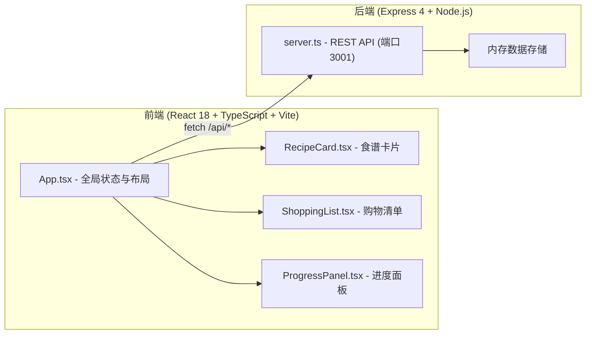
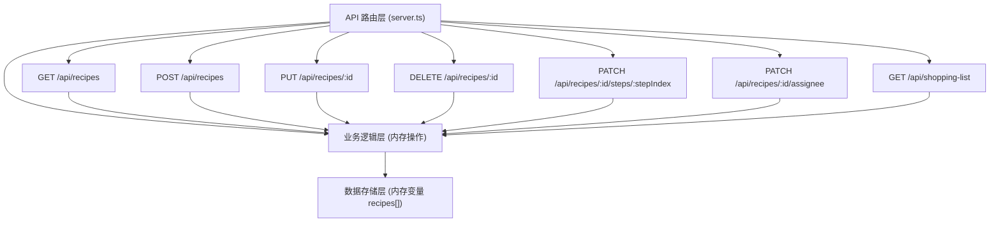
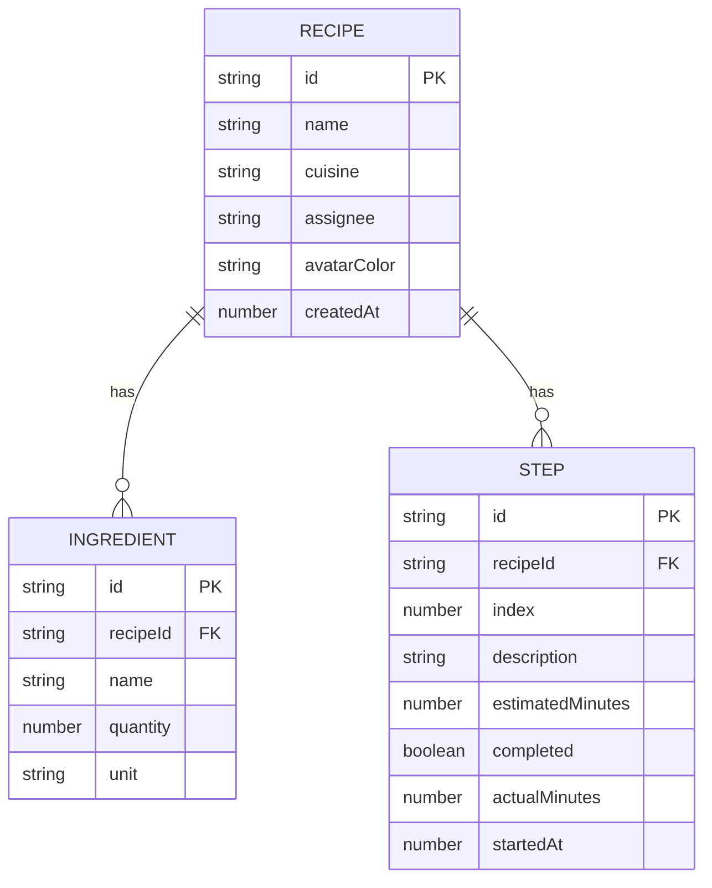

## 1. 架构设计



## 2. 技术说明

- **前端框架**：React@18.2.0 + TypeScript@5.3.3
- **构建工具**：Vite@5.0.8 + @vitejs/plugin-react@4.2.0
- **后端框架**：Express@4.18.2
- **跨域处理**：cors
- **唯一ID生成**：uuid
- **数据存储**：内存存储（后端内存变量）
- **状态管理**：React useState/useEffect（无需额外库）
- **样式方案**：纯CSS + CSS变量（不使用Tailwind，按需求精确像素控制）

## 3. 文件结构定义

| 路径 | 用途 |
|------|------|
| `/package.json` | 项目依赖与启动脚本 |
| `/vite.config.js` | Vite构建配置（含@路径别名） |
| `/tsconfig.json` | TypeScript配置（严格模式，target ES2020） |
| `/index.html` | Vite入口HTML |
| `/src/types.ts` | 核心TypeScript接口定义 |
| `/src/server.ts` | Express后端服务，REST API |
| `/src/main.tsx` | React渲染入口 |
| `/src/App.tsx` | 主应用组件，全局状态与布局 |
| `/src/components/RecipeCard.tsx` | 食谱卡片与详情浮层 |
| `/src/components/ShoppingList.tsx` | 购物清单表格与导出 |
| `/src/components/ProgressPanel.tsx` | 进度面板与负责人分配 |

## 4. API 定义

### 4.1 接口列表

| Method | Route | 用途 |
|--------|-------|------|
| GET | `/api/recipes` | 获取所有食谱列表 |
| GET | `/api/recipes/:id` | 获取单个食谱详情 |
| POST | `/api/recipes` | 创建新食谱 |
| PUT | `/api/recipes/:id` | 更新食谱信息 |
| DELETE | `/api/recipes/:id` | 删除食谱 |
| PATCH | `/api/recipes/:id/steps/:stepIndex` | 标记步骤完成/未完成 |
| PATCH | `/api/recipes/:id/assignee` | 分配/修改负责人 |
| GET | `/api/shopping-list` | 获取汇总购物清单（自动去重累加） |

### 4.2 TypeScript 类型定义

```typescript
type CuisineType = 'chinese' | 'western' | 'japanese' | 'other';

interface Ingredient {
  id: string;
  name: string;
  quantity: number;
  unit: string;
}

interface Step {
  id: string;
  index: number;
  description: string;
  estimatedMinutes: number;
  completed: boolean;
  actualMinutes?: number;
  startedAt?: number;
}

interface Recipe {
  id: string;
  name: string;
  cuisine: CuisineType;
  ingredients: Ingredient[];
  steps: Step[];
  assignee?: string;
  avatarColor?: string;
  createdAt: number;
}

interface ShoppingItem {
  name: string;
  totalQuantity: number;
  unit: string;
  purchased: boolean;
}
```

## 5. 服务端架构图



## 6. 数据模型

### 6.1 实体关系图



### 6.2 初始种子数据

应用启动时预置3个示例食谱：
1. 红烧肉（中餐，5步）
2. 凯撒沙拉（西餐，4步）
3. 寿司卷（日料，6步）
