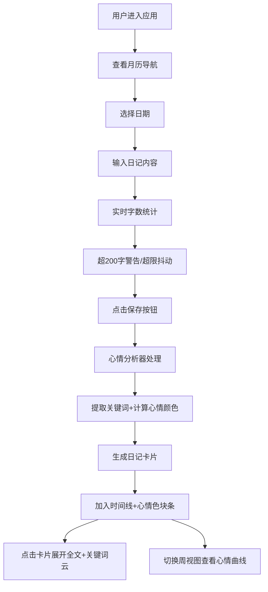

## 1. 产品概述

基于时间线的数字日记与心情色彩分析应用，帮助用户通过每日记录实现情绪可视化与自我觉察。
- 核心目标：让日记书写变得有趣，通过色彩直观展示心情变化趋势，支持长期心情追踪
- 目标用户：关注心理健康、喜欢记录生活的个人用户

## 2. 核心功能

### 2.1 用户角色
| 角色 | 注册方式 | 核心权限 |
|------|----------|----------|
| 普通用户 | 无需注册，本地存储 | 书写日记、查看时间线、切换周/日视图 |

### 2.2 功能模块
1. **日记输入模块**：文本输入区、字数统计、保存按钮、心情色彩分析
2. **时间线展示模块**：日记卡片列表、展开全文、关键词云、卡片动画
3. **心情色块条模块**：7天心情色块、悬停标签、周视图连接曲线
4. **日历导航模块**：月历视图、日期跳转、心情标记、翻页动画
5. **视图切换模块**：日视图/周视图切换、响应式布局

### 2.3 页面详情
| 页面名称 | 模块名称 | 功能描述 |
|----------|----------|----------|
| 主页 | 日记输入模块 | 300字限制文本输入、实时字数统计、超200字警告色、超限阻止输入并抖动、渐变保存按钮 |
| 主页 | 时间线模块 | 日记卡片展示（宽280px圆角16px）、顶部心情色带8px、日期+摘要+色块圆点、点击展开关键词云 |
| 主页 | 心情色块条 | 最近7天色块（40x80px圆角8px）、间距4px、悬停显示标签、周视图平滑连接曲线（1.5s动画） |
| 主页 | 月历导航 | 6x7网格日历、当天高亮、心情日标记、点击跳转、翻页动画（0.5s scaleX） |

## 3. 核心流程

用户进入应用 → 查看月历导航 → 选择日期或当日 → 输入日记内容（300字内）→ 系统实时字数统计 → 点击保存按钮 → 心情分析器提取关键词并计算心情颜色 → 生成日记卡片加入时间线 → 当天心情色块出现在色块条中 → 可点击卡片展开查看全文和关键词云 → 切换周视图查看心情变化曲线 → 通过日历导航查看历史日记

## 4. 用户界面设计

### 4.1 设计风格
- 主色调：#6366F1（靛蓝），强调色：#8B5CF6（紫色）
- 警告色：#EAB308（金色），错误色：#EF4444（红色）
- 背景色：#F3F4F6（浅灰），卡片背景：#FFFFFF（白色）
- 按钮风格：圆角20px，渐变色#8B5CF6→#6366F1，悬停右移3px+发光
- 字体：现代无衬线字体，14/16/28px层级
- 布局风格：三栏布局（日历+输入+时间线），卡片化设计
- 图标风格：简洁线性图标

### 4.2 页面设计概览
| 页面名称 | 模块名称 | UI元素 |
|----------|----------|--------|
| 主页 | 日记输入模块 | 渐变保存按钮(160x48px圆角20px)、字数统计(超200字#EAB308放大1.02x)、超限边框#EF4444抖动0.4s |
| 主页 | 时间线模块 | 卡片(280px宽圆角16px，2px边框#E5E7EB)、8px顶色带、悬停上浮6px加深阴影0.3s ease-out、关键词云(14-28px字号) |
| 主页 | 心情色块条 | 色块(40x80px圆角8px)、#F9FAFB底色居中、悬停标签(白色圆角8px 2px阴影 淡入0.2s)、周视图曲线(3px宽渐变 1.5s动画) |
| 主页 | 月历导航 | 6行7列、当天#6366F1圆圈、心情日4px圆点、翻页动画(0.5s scaleX) |

### 4.3 响应式设计
- 桌面端（>768px）：三栏布局（左：月历导航，中：日记输入，右：时间线+心情色块条）
- 平板端（480-768px）：两栏布局（左：输入+月历，右：时间线+色块条）
- 移动端（<480px）：单栏垂直布局，自上而下：月历→输入→时间线→色块条

### 4.4 动画与性能
- 所有过渡动画：ease-out 0.3秒
- 周视图曲线绘制：1.5秒从左到右显现
- 翻页动画：0.5秒 scaleX 1→0→1
- 关键词提取：100ms内完成
- 目标帧率：60fps
