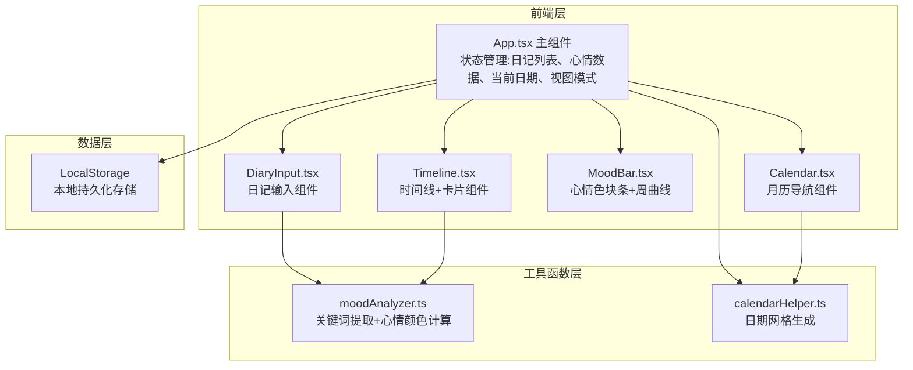

## 1. 架构设计



## 2. 技术描述
- 前端框架：React@18.2.0 + TypeScript@5.3.3
- 构建工具：Vite@5.0.8 + @vitejs/plugin-react@4.2.0
- 状态管理：React Hooks (useState, useEffect)
- 样式方案：纯CSS + CSS Variables，内联样式处理动态值
- 数据存储：LocalStorage 本地持久化
- 初始化工具：Vite脚手架手动配置

## 3. 目录结构
```
src/
├── App.tsx              # 主组件，状态管理与布局
├── components/
│   ├── DiaryInput.tsx   # 日记输入组件
│   ├── Timeline.tsx     # 时间线与卡片组件
│   ├── MoodBar.tsx      # 心情色块条组件
│   └── Calendar.tsx     # 月历导航组件
└── utils/
    ├── moodAnalyzer.ts  # 心情分析工具
    └── calendarHelper.ts # 日历辅助工具
```

## 4. 数据模型

### 4.1 DiaryEntry 数据类型
```typescript
interface DiaryEntry {
  id: string;           // UUID 唯一标识
  date: string;         // YYYY-MM-DD 格式日期
  content: string;      // 日记完整内容
  moodColor: string;    // 心情颜色 hex 值
  keywords: Keyword[];  // 关键词数组
  createdAt: number;    // 创建时间戳
}

interface Keyword {
  text: string;         // 关键词文本
  weight: number;       // 权重 0-1，决定字号和透明度
}

interface CalendarDay {
  date: Date;           // 日期对象
  dayOfWeek: number;    // 0-6 星期
  isCurrentMonth: boolean; // 是否当前月
  isToday: boolean;     // 是否今天
  hasEntry: boolean;    // 是否有日记
  moodColor?: string;   // 心情颜色
}
```

## 5. 核心API（内部函数）

### 5.1 moodAnalyzer.ts
```typescript
// 分析日记文本，提取关键词并计算心情颜色
function analyzeMood(text: string): {
  color: string;       // hex 颜色值
  keywords: Keyword[]; // 关键词数组
}

// 心情色系映射
const MOOD_PALETTE = {
  joyful: '#FDE68A',   // 欢快 - 暖黄
  happy: '#A7F3D0',    // 开心 - 青绿
  peaceful: '#BFDBFE', // 平静 - 天蓝
  neutral: '#E5E7EB',  // 平淡 - 浅灰
  sad: '#DDD6FE',      // 忧伤 - 淡紫
  anxious: '#FECACA',  // 焦虑 - 粉红
  angry: '#FCA5A5',    // 愤怒 - 珊瑚红
}
```

### 5.2 calendarHelper.ts
```typescript
// 生成某年某月的日期网格（6行7列）
function generateCalendarGrid(
  year: number,
  month: number,
  entries: DiaryEntry[]
): CalendarDay[][];

// 获取最近7天的日期数组
function getLast7Days(baseDate?: Date): Date[];

// 格式化日期为 YYYY-MM-DD
function formatDate(date: Date): string;
```

## 6. 组件 Props 定义

### 6.1 DiaryInput Props
```typescript
interface DiaryInputProps {
  date: string;                          // 当前编辑日期
  onSave: (entry: Omit<DiaryEntry, 'id' | 'createdAt'>) => void;
  initialContent?: string;               // 已有内容（编辑模式）
}
```

### 6.2 Timeline Props
```typescript
interface TimelineProps {
  entries: DiaryEntry[];
  onSelectDate: (date: string) => void;
}
```

### 6.3 MoodBar Props
```typescript
interface MoodBarProps {
  entries: DiaryEntry[];
  viewMode: 'day' | 'week';
  baseDate: Date;
}
```

### 6.4 Calendar Props
```typescript
interface CalendarProps {
  currentMonth: { year: number; month: number };
  entries: DiaryEntry[];
  selectedDate: string;
  onSelectDate: (date: string) => void;
  onChangeMonth: (year: number, month: number) => void;
}
```
