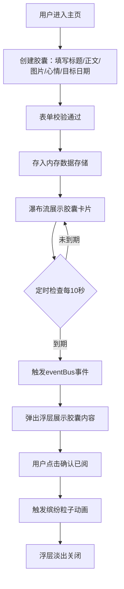

## 1. 产品概述

时间胶囊与回忆唤醒应用，用户可在特定日期给未来的自己创建包含文字、图片和心情的备忘胶囊，系统在设定日期自动弹窗提醒用户回看。

- 主要目的：帮助用户记录当下心情、存储回忆，在未来特定时间点唤醒珍贵记忆
- 目标用户：希望记录生活、保留回忆的所有互联网用户
- 产品价值：提供温暖的情感寄托方式，通过时间延迟机制创造惊喜与感动

## 2. 核心功能

### 2.1 功能模块

1. **胶囊创建模块**：目标日期、标题、正文（500字限制+字数统计+进度条）、图片URL预览、心情表情五选一
2. **胶囊时间线模块**：瀑布流展示所有胶囊卡片，显示倒计时，支持到期状态标识
3. **回忆唤醒模块**：每10秒自动检查到期胶囊，弹出精美浮层展示内容，粒子动画庆祝效果
4. **侧边栏摘要模块**：展示最近5条胶囊摘要和倒计时

### 2.2 页面详情

| 页面名称 | 模块名称 | 功能描述 |
|-----------|-------------|---------------------|
| 主页 | 胶囊创建表单 | 日期选择、标题输入、正文编辑（含字数统计和进度条）、图片URL+缩略图预览、心情表情选择器 |
| 主页 | 侧边栏摘要 | 左侧240px边栏，展示最近创建的5条胶囊摘要和倒计时 |
| 主页 | 瀑布流时间线 | 右侧主区域，瀑布流布局展示全部胶囊卡片，支持响应式（三/两/单列） |
| 主页 | 到期弹窗浮层 | 屏幕中央弹出圆角浮层，展示标题、可滚动正文、心情表情动画，确认已阅按钮 |

## 3. 核心流程

用户创建时间胶囊，填写内容并选择未来日期，系统保存后在瀑布流中展示。后台定时检查，当胶囊到期时触发弹窗提醒用户查看。

## 4. 用户界面设计

### 4.1 设计风格

- **主色调**：深色模式，背景#111827，面板#1F2937
- **强调色**：紫色渐变#7C3AED → #6D28D9，进度条绿色#10B981，警告橙色#F59E0B，到期红色#DC2626
- **心情色**：开心#FBBF24、平静#60A5FA、伤感#818CF8、愤怒#F87171、疲惫#A78BFA
- **按钮风格**：圆角22px渐变按钮，宽160px高44px
- **卡片风格**：280px宽，圆角12px，白色背景，#E5E7EB边框，悬停上浮6px加深阴影
- **字体**：系统无衬线字体，标题22px加粗，倒计时20px加粗
- **布局**：左侧窄边栏（240px）+ 右侧主区域瀑布流
- **动效**：心情表情缩放选中、到期脉冲、浮层fadeOut、纸屑粒子散落

### 4.2 页面设计概述

| 页面名称 | 模块名称 | UI元素 |
|-----------|-------------|-------------|
| 主页 | 胶囊创建表单 | 深色面板背景，输入框圆角，字数进度条(#10B981)，超400字边框变橙(#F59E0B)闪烁，图片预览128x128圆角8px，心情表情点击放大1.2倍+1px边框 |
| 主页 | 侧边栏摘要 | 240px宽度，深色背景，最近5条胶囊卡片式摘要，倒计时显示 |
| 主页 | 瀑布流时间线 | 卡片280px宽圆角12px白背景，倒计时#7C3AED加粗20px，负值变#DC2626脉冲，悬停上浮6px 0.25s ease-out |
| 主页 | 到期弹窗浮层 | 500x400px圆角24px，4px#7C3AED渐变边框，白色背景20px内边距，底部心情表情1.1→1.0缩放周期0.5s，确认按钮渐变，关闭fadeOut 0.5s + 粒子2s |

### 4.3 响应式

- Desktop-first设计
- ≥1024px：三列瀑布流 + 左侧边栏
- 768-1023px：两列瀑布流 + 左侧边栏
- <768px：单列瀑布流，隐藏左侧边栏

### 4.4 性能要求

- 50个胶囊卡片首次渲染 ≤ 800ms
- 滚动帧率稳定 ≥ 55fps
