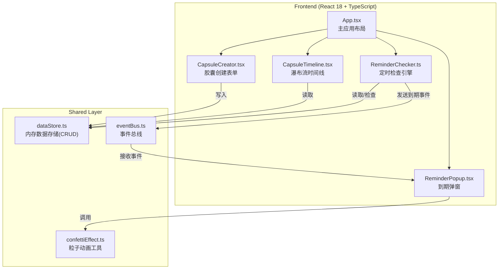
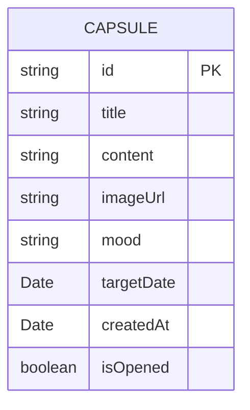

## 1. 架构设计



## 2. 技术描述

- **前端框架**：React@18.2.0 + TypeScript@5.3.3
- **构建工具**：Vite@5.0.8 + @vitejs/plugin-react@4.2.0
- **样式方案**：原生CSS + CSS Modules（内联样式处理动态颜色）
- **状态管理**：内存数据存储（dataStore.ts单例）+ 事件总线解耦
- **初始化方式**：手动创建项目结构（符合用户指定文件结构）

## 3. 文件结构

```
auto44/
├── index.html
├── package.json
├── tsconfig.json
├── vite.config.js
└── src/
    ├── App.tsx
    ├── main.tsx
    ├── index.css
    ├── modules/
    │   ├── capsuleManager/
    │   │   ├── CapsuleCreator.tsx
    │   │   └── CapsuleTimeline.tsx
    │   └── reminderEngine/
    │       ├── ReminderChecker.ts
    │       └── ReminderPopup.tsx
    ├── shared/
    │   ├── dataStore.ts
    │   └── eventBus.ts
    └── utils/
        └── confettiEffect.ts
```

## 4. 数据模型

### 4.1 数据模型定义



### 4.2 TypeScript类型定义

```typescript
type MoodType = 'happy' | 'calm' | 'sad' | 'angry' | 'tired';

interface Capsule {
  id: string;
  title: string;
  content: string;
  imageUrl: string;
  mood: MoodType;
  targetDate: string;
  createdAt: string;
  isOpened: boolean;
}
```

## 5. 核心接口

### 5.1 dataStore接口

```typescript
interface DataStore {
  createCapsule(data: Omit<Capsule, 'id' | 'createdAt' | 'isOpened'>): Capsule;
  getAllCapsules(): Capsule[];
  getRecentCapsules(limit: number): Capsule[];
  getDueCapsules(): Capsule[];
  markAsOpened(id: string): void;
  subscribe(callback: () => void): () => void;
}
```

### 5.2 eventBus接口

```typescript
interface EventBus {
  on(event: 'capsule-due', callback: (capsule: Capsule) => void): () => void;
  emit(event: 'capsule-due', capsule: Capsule): void;
}
```

### 5.3 ReminderChecker接口

```typescript
interface ReminderChecker {
  start(): void;
  stop(): void;
}
```
