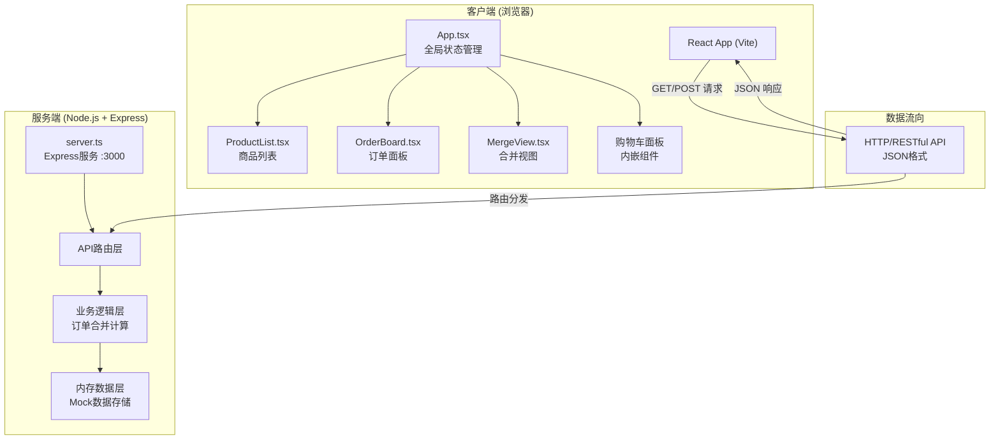
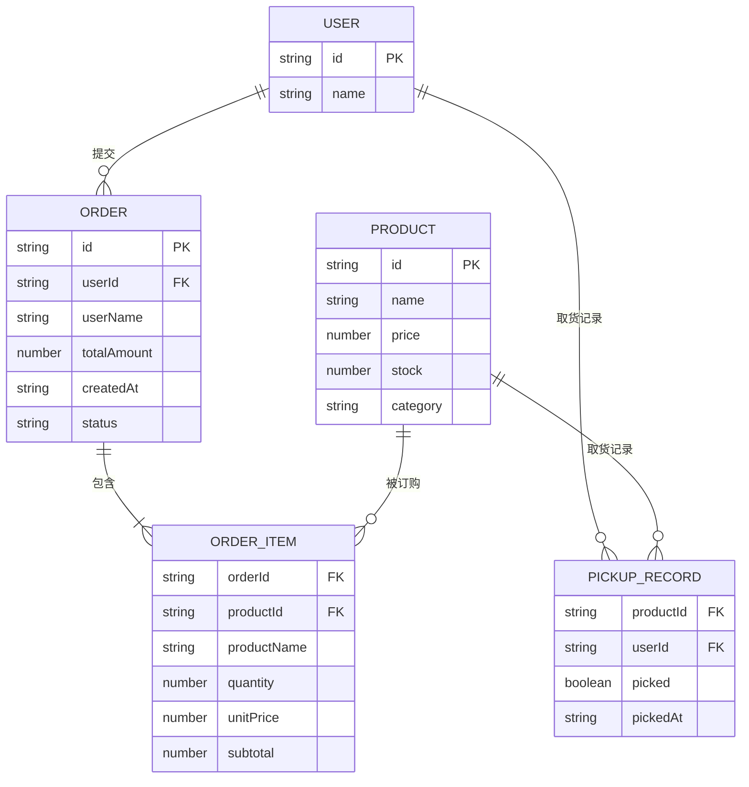

## 1. 架构设计



## 2. 技术说明

### 2.1 前端技术栈
- **框架**：React 18.2.0
- **渲染**：React DOM 18.2.0，JSX 模式 react-jsx
- **构建工具**：Vite 5.0.8
- **React 插件**：@vitejs/plugin-react 4.2.0
- **语言**：TypeScript 5.3.3（严格模式 strict:true，target ES2020）
- **路径别名**：@ → src 目录

### 2.2 后端技术栈
- **运行时**：Node.js
- **Web 框架**：Express 4.18.2
- **跨域支持**：CORS 2.8.5
- **ID 生成**：UUID 9.0.0
- **数据存储**：内存对象（无需持久化，进程重启重置）
- **监听端口**：3000

### 2.3 初始化方式
- 手动创建项目文件结构，不依赖脚手架工具
- 通过 `npm run dev` 启动（需配置为同时启动 Vite 前端和 Express 后端）

## 3. 文件结构与调用关系

```
项目根目录
├── package.json              # 依赖与启动脚本配置
├── vite.config.js            # Vite 构建配置 + @路径别名
├── tsconfig.json             # TypeScript 严格模式配置
├── index.html                # 入口 HTML，挂载 root div
└── src/
    ├── server.ts             # Express 后端：路由 → 业务 → 内存存储
    ├── App.tsx               # React 根组件：状态管理 → API 调用 → 子组件渲染
    ├── styles.css            # 全局样式、主题变量、响应式、动画
    └── components/
        ├── ProductList.tsx   # 商品列表：接收 products props → 卡片网格 → 弹窗回调
        ├── OrderBoard.tsx    # 订单面板：接收 userId+orders → 列表渲染 → 修改回调
        └── MergeView.tsx     # 合并视图：接收 mergedOrders → 表格渲染 → 取货状态回调
```

### 调用关系与数据流向

| 层级 | 源文件 | 调用目标 | 数据流向 |
|------|--------|----------|----------|
| 前端入口 | index.html | App.tsx | DOM 挂载点 → React 渲染 |
| 前端根 | App.tsx | ProductList / OrderBoard / MergeView | State/Props 向下传递，回调向上冒泡 |
| 前端根 | App.tsx | server.ts (HTTP) | fetch GET/POST → JSON 请求/响应 |
| 组件 | ProductList.tsx | App.tsx | onAddToCart(productId, qty) |
| 组件 | OrderBoard.tsx | App.tsx | onModifyOrder / onCancelOrder 回调 |
| 组件 | MergeView.tsx | App.tsx | onMarkPicked 回调 |
| 后端入口 | server.ts | 内存数据层 | 请求参数 → 业务处理 → 内存读写 → JSON 响应 |
| 后端 | server.ts 订单合并 | 所有订单数据 | 遍历 orders → 按 productId 分组 → 聚合数量/金额 |

## 4. API 定义

### 4.1 类型定义（TypeScript）

```typescript
// 商品
interface Product {
  id: string;
  name: string;
  price: number;       // 单价（元）
  stock: number;       // 库存数量
  category: string;    // 分类：水果/零食/日用品等
}

// 订单项
interface OrderItem {
  productId: string;
  productName: string;
  quantity: number;
  unitPrice: number;
  subtotal: number;
}

// 订单
interface Order {
  id: string;
  userId: string;
  userName: string;
  items: OrderItem[];
  totalAmount: number;
  createdAt: string;   // ISO 时间戳
  status: 'active' | 'cancelled';
}

// 合并订单条目（按商品聚合）
interface MergedOrderItem {
  productId: string;
  productName: string;
  totalQuantity: number;
  totalAmount: number;
  userBreakdown: Array<{
    userId: string;
    userName: string;
    quantity: number;
    picked: boolean;
    pickedAt?: string;
  }>;
}

// 用户
interface User {
  id: string;
  name: string;
}
```

### 4.2 RESTful API 列表

| 方法 | 路径 | 用途 | 请求体 | 响应体 |
|------|------|------|--------|--------|
| GET | `/api/products` | 获取商品列表 | 无 | `Product[]` |
| POST | `/api/products` | 管理员新增商品 | `{name, price, stock, category}` | `Product` |
| PUT | `/api/products/:id` | 调整商品库存 | `{stock: number}` | `Product` |
| GET | `/api/orders` | 获取订单列表（可按用户过滤） | Query: `?userId=xxx` | `Order[]` |
| POST | `/api/orders` | 提交订单 | `{userId, userName, items: [{productId, quantity}]}` | `Order` |
| PUT | `/api/orders/:id` | 修改订单数量 | `{items: [{productId, quantity}]}` | `Order` |
| DELETE | `/api/orders/:id` | 取消订单 | 无 | `{success: true}` |
| GET | `/api/merged-orders` | 获取按商品合并的订单 | 无 | `MergedOrderItem[]` |
| POST | `/api/pickup` | 标记取货状态 | `{productId, userId, picked: boolean}` | `{success: true, pickedAt: string}` |
| GET | `/api/users` | 获取预设用户列表 | 无 | `User[]` |
| GET | `/api/stats` | 获取统计数据概览 | 无 | `{totalOrders, totalProducts, totalAmount, pickedRate}` |

## 5. 服务端架构


### 5.1 内存数据结构（server.ts 内部）

```
products: Map<string, Product>   // 预置8+种商品
orders:   Map<string, Order>     // 所有提交的订单
pickups:  Map<string, boolean>   // key = `${productId}_${userId}`, value = 是否已取货
pickupTimes: Map<string, string> // key = `${productId}_${userId}`, value = ISO时间戳
users:    User[]                 // 固定3个用户（张三/李四/王五）
```

### 5.2 订单合并算法逻辑

```
输入：orders Map 中所有 status='active' 的订单
输出：MergedOrderItem[]
步骤：
  1. 初始化空 map<productId, MergedOrderItem>
  2. 遍历每个订单 → 遍历其 items
  3. 根据 productId 累加 totalQuantity 和 totalAmount
  4. 将当前用户+数量 push 到 userBreakdown
  5. 查询 pickups map 填充 picked 和 pickedAt 字段
  6. 将 map values 转为数组返回
```

## 6. 数据模型

### 6.1 ER 关系图



### 6.2 初始 Mock 数据（预置在 server.ts 中）

**用户表（3个）**：
| id | name |
|----|------|
| user-1 | 张三 |
| user-2 | 李四 |
| user-3 | 王五 |

**商品表（至少8种）**：
| id | name | price | stock | category |
|----|------|-------|-------|----------|
| p-1 | 红富士苹果 | 6.80 | 50 | 水果 |
| p-2 | 海南香蕉 | 4.50 | 3 | 水果 |
| p-3 | 进口车厘子 | 68.00 | 10 | 水果 |
| p-4 | 乐事薯片 | 8.90 | 30 | 零食 |
| p-5 | 每日坚果 | 29.90 | 4 | 零食 |
| p-6 | 卷纸（10卷） | 25.00 | 20 | 日用品 |
| p-7 | 洗衣液 2L | 35.80 | 15 | 日用品 |
| p-8 | 土鸡蛋（30枚） | 38.00 | 12 | 食品 |
| p-9 | 鲜牛奶 1L | 15.90 | 8 | 食品 |
| p-10 | 全麦面包 | 12.00 | 25 | 食品 |
