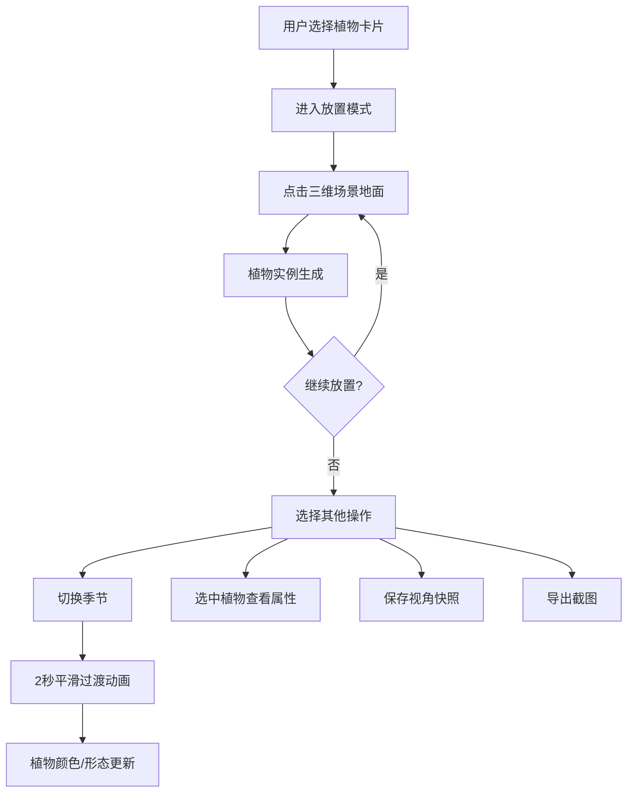

## 1. 产品概述

三维花园景观搭配与四季演化模拟应用——面向景观设计师的实时交互式三维场景预览工具，允许用户从预设植物库中选择乔木、灌木和花卉，在三维庭院场景中自由拖拽放置，并实时预览春、夏、秋、冬四季的植物生长状态与色彩变化，解决手动渲染每个角度和季节预览图费时费力的问题。

- 目标用户：景观设计师、园林规划人员
- 核心价值：将季节预览渲染从数小时缩短到即时切换，提升客户沟通效率

## 2. 核心功能

### 2.1 功能模块

1. **主场景页**：三维花园场景、植物放置与选中交互、四季视觉切换、视角导航与快照、导出截图

### 2.2 页面详情

| 页面名称 | 模块名称 | 功能描述 |
|----------|----------|----------|
| 主场景页 | 三维场景渲染 | Three.js渲染庭院场景，包含地面、天空、植物模型，支持OrbitControls旋转缩放 |
| 主场景页 | 植物库选择面板 | D3.js渲染植物卡片列表（乔木/灌木/花卉各5+种），点击高亮进入放置模式 |
| 主场景页 | 场景放置交互 | 放置模式下点击地面生成植物实例，随机旋转，底部阴影 |
| 主场景页 | 四季切换滑块 | 水平滑块切换春夏秋冬，2秒平滑过渡动画，环境光颜色变化 |
| 主场景页 | 已放置植物列表 | 列表显示已放置植物，带删除按钮，删除时滑出动画 |
| 主场景页 | 植物选中与属性面板 | 点击植物显示旋转线框环高亮，弹出属性面板显示名称/冠幅/颜色 |
| 主场景页 | 视角快照区 | 空格键保存视角快照，缩略图展示，点击恢复视角，最多5个 |
| 主场景页 | 导出截图 | 1920x1080分辨率截图，新标签页打开 |

## 3. 核心流程

1. 用户从右侧控制面板植物库中选择植物卡片 → 进入放置模式
2. 在三维场景地面点击 → 植物实例生成在点击位置
3. 拖拽季节滑块 → 所有植物颜色/形态2秒内平滑过渡到对应季节
4. 点击已放置植物 → 选中高亮 + 属性面板弹出
5. 空格键 → 保存当前视角快照 → 点击快照恢复视角
6. 点击导出 → 隐藏UI → 截图 → 新标签页展示

## 4. 用户界面设计

### 4.1 设计风格

- 主题：深色专业工具风格
- 主色：#0F172A（背景）、#1E293B（面板）、#3B82F6（交互高亮）
- 强调色：#10B981（植物选中边框）、#EF4444（删除/关闭）、#60A5FA（选中环）
- 字体：系统无衬线字体，标题20px/600，正文14px，辅助文字12px
- 布局：左侧80%三维场景 + 右侧380px控制面板
- 圆角：卡片8px、按钮50%、面板12px
- 交互反馈：0.2-0.3秒ease-out过渡

### 4.2 页面设计详情

| 页面名称 | 模块名称 | UI元素 |
|----------|----------|--------|
| 主场景页 | 三维场景 | 占左侧80%宽度，天空#87CEEB渐变，绿色地面，OrbitControls导航 |
| 主场景页 | 控制面板 | 右侧固定380px，背景#1E293B，顶部标题栏60px |
| 主场景页 | 植物库区域 | 占面板45%，4列网格，卡片80x100px圆角8px背景#334155，悬停1.1倍缩放 |
| 主场景页 | 季节滑块 | 占10%，水平轨道高8px圆角4px背景#475569，圆形滑块16px背景#3B82F6 |
| 主场景页 | 已放置列表 | 占25%，项高48px，删除按钮24px圆角50%背景#EF4444，滑出消失0.3秒 |
| 主场景页 | 快照区 | 占20%，横向滚动，160x90px圆角8px带阴影 |
| 主场景页 | 属性面板 | 右侧弹出，宽280px背景#1F2937圆角12px内边距16px，关闭按钮28x28px圆角50%#EF4444 |

### 4.3 响应式适配

- 桌面端（≥1200px）：左侧80%场景 + 右侧380px面板
- 窄屏（<1200px）：场景60vh高度 + 面板100%宽度在下方，可滚动长面板

### 4.4 三维场景指引

- 环境：天空渐变#87CEEB，绿色地面平面，环境光随季节变化
- 光照：方向光模拟太阳 + 环境光（春暖黄/夏亮白/秋橙红/冬冷蓝）
- 相机：透视相机，OrbitControls，缩放0.5-5.0
- 交互：点击地面放置植物，点击植物选中，旋转线框环高亮
- 季节动画：植物颜色2秒ease-in-out渐变，秋天落叶粒子，冬天积雪平面
- 性能：单植物≤1500三角形，BufferGeometry合并，30株植物保持60fps
