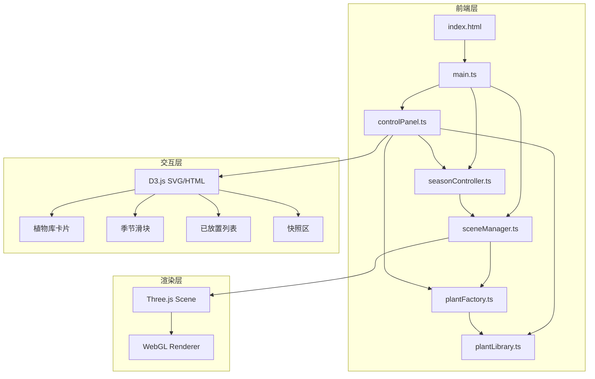

## 1. 架构设计



## 2. 技术说明

- 前端框架：TypeScript + Three.js@0.160.0 + D3.js@7.8.5
- 构建工具：Vite@5.0.8
- 无后端：纯前端应用，所有数据内置
- 状态管理：模块间直接方法调用，无额外状态库

## 3. 数据流向

```
用户操作 → controlPanel.ts 事件
    ├→ plantLibrary.ts 查询植物数据
    ├→ plantFactory.ts 创建植物网格
    ├→ sceneManager.ts 添加/移除植物
    └→ seasonController.ts 切换季节
        └→ sceneManager.setSeason()
            └→ plantFactory 切换颜色变体
                └→ Three.js 渲染更新
```

## 4. 模块职责

| 模块文件 | 职责 | 对外接口 |
|----------|------|----------|
| main.ts | 应用入口，初始化场景和面板，启动渲染循环 | - |
| sceneManager.ts | 创建Three.js场景/相机/控制器，管理植物实例 | addPlant / removePlant / setSeason / getScene / getCamera |
| plantFactory.ts | 根据类型和季节生成植物网格模型 | createPlant / updatePlantSeason |
| seasonController.ts | 处理季节切换事件，触发过渡动画 | dispatch / getCurrentSeason |
| plantLibrary.ts | 定义植物数据结构，提供查询过滤接口 | getPlantsByCategory / getPlantById / filterPlants |
| controlPanel.ts | D3.js渲染控制面板UI，处理用户交互 | init / updatePlantList / addSnapshot |

## 5. 植物数据模型

```typescript
interface PlantData {
  id: string;
  name: string;
  category: 'tree' | 'shrub' | 'flower';
  climate: string;
  seasons: {
    spring: { color: [number, number, number, number]; heightScale: number; foliageScale: number };
    summer: { color: [number, number, number, number]; heightScale: number; foliageScale: number };
    autumn: { color: [number, number, number, number]; heightScale: number; foliageScale: number };
    winter: { color: [number, number, number, number]; heightScale: number; foliageScale: number };
  };
  heightRange: [number, number];
  crownRange: [number, number];
  bloomMonths: number[];
}
```

## 6. 性能优化策略

- 植物工厂使用BufferGeometry合并网格，单植物≤1500三角形
- 季节动画使用requestAnimationFrame + 缓动函数，避免卡顿
- 30株植物场景四季切换FPS≥45，目标60fps
- 季节切换响应延迟≤100ms
- 使用InstancedMesh优化同类植物渲染（如需要）
