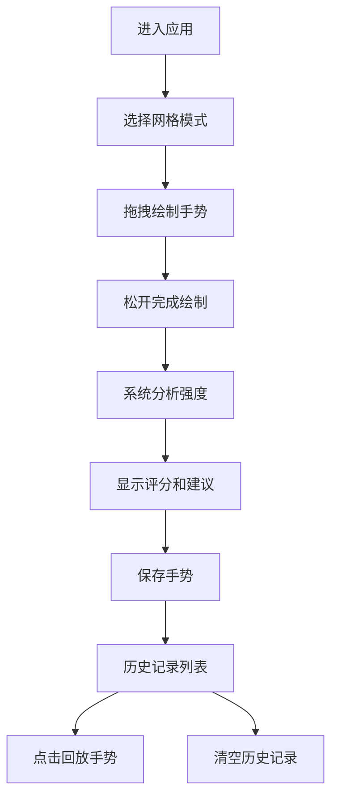

## 1. 产品概述

手势密码强度分析应用是一款帮助用户创建、评估和优化手势密码的Web工具。用户通过在网格上绘制手势路径，系统实时分析密码复杂度并提供改进建议，提升账户安全性。

## 2. 核心功能

### 2.1 功能模块
1. **手势绘制模块**：支持3x3和4x4两种网格模式，鼠标/触屏交互绘制
2. **强度分析模块**：实时计算密码强度评分，多维度分析
3. **UI反馈模块**：强度条、评分显示、改进建议
4. **历史记录模块**：保存最多5个手势，支持回放和清空

### 2.3 页面详情
| 页面名称 | 模块名称 | 功能描述 |
|-----------|-------------|---------------------|
| 主页 | 网格绘制区 | Canvas绘制手势节点和连线，支持拖拽绘制 |
| 主页 | 模式切换 | 3x3/4x4网格切换，平滑过渡动画 |
| 主页 | 反馈面板 | 强度条渐变色显示，评分和改进建议 |
| 主页 | 历史记录 | 保存、列表展示、回放、清空功能 |
| 主页 | 确认浮层 | 保存成功提示，淡入动画 |

## 3. 核心流程

用户进入应用 → 选择网格模式 → 拖拽绘制手势 → 松开完成绘制 → 系统实时分析强度 → 显示评分和建议 → 用户可保存手势 → 查看历史记录 → 点击回放手势 → 清空历史记录

## 4. 用户界面设计

### 4.1 设计风格
- 主色调：蓝色#3B82F6、紫色#6366F1
- 警示色：红色#EF4444
- 中性色：白色#FFFFFF、浅灰#F8FAFC、中灰#E2E8F0、深灰#64748B、文字#1E293B
- 按钮风格：圆角8px，带hover过渡动画
- 字体：系统无衬线字体，标题22px字重600，正文14px
- 布局：垂直分栏，极简扁平加微阴影风格
- 动画：所有交互0.2-0.3秒CSS过渡

### 4.2 页面设计概述
| 页面名称 | 模块名称 | UI元素 |
|-----------|-------------|-------------|
| 主页 | 网格绘制区 | Canvas画布、节点圆（空心/实心）、连线（渐现动画） |
| 主页 | 模式切换 | 32x32px圆角按钮，下划线指示当前模式 |
| 主页 | 反馈面板 | 320px宽白色卡片，强度条渐变，文本建议 |
| 主页 | 历史记录 | 侧边栏列表，48px高条目，hover背景变化 |
| 主页 | 操作按钮 | 保存、重置、清空按钮，统一圆角风格 |

### 4.3 响应式
- Desktop-first设计，768px以下响应式变为上下排列
- 网格在上全宽，面板在下全宽
- 支持触屏手势操作

### 4.4 视觉细节
- 强度条渐变：红#EF4444（0-33%）→ 黄#F59E0B（33-66%）→ 绿#22C55E（66-100%）
- 节点样式：正常空心边框2px#3B82F6，选中实心填充#3B82F6
- 连线样式：2px实线#6366F1，0.2秒渐现动画
- 卡片阴影：微阴影提升层次感
- 切换过渡：网格模式切换0.3秒平滑过渡
