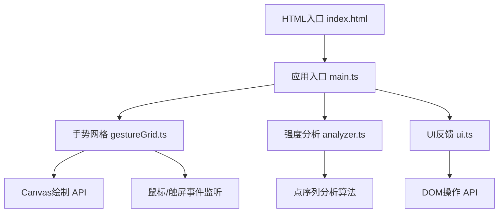

## 1. 架构设计



## 2. 技术描述

- 前端：TypeScript@5.3.3 + Vite@5.0.8
- 构建工具：Vite@5.0.8
- 语言：TypeScript（严格模式，target ES2020）
- 渲染：HTML5 Canvas 2D API
- 样式：原生CSS + CSS Variables
- 无后端，数据存储于内存

## 3. 文件结构

| 文件路径 | 用途 |
|---------|------|
| package.json | 项目依赖和脚本 |
| vite.config.js | Vite构建配置 |
| tsconfig.json | TypeScript编译配置 |
| index.html | 入口HTML页面 |
| src/main.ts | 应用入口，模块整合 |
| src/gestureGrid.ts | 手势网格绘制与交互 |
| src/analyzer.ts | 密码强度分析 |
| src/ui.ts | UI反馈与历史记录 |

## 4. 核心数据结构

### 4.1 点序列
```typescript
interface Point {
  row: number;
  col: number;
  x: number;
  y: number;
}

type GestureSequence = Point[];
```

### 4.2 强度分析结果
```typescript
interface AnalysisResult {
  score: number;           // 0-100
  level: 'weak' | 'medium' | 'strong';
  length: number;
  intersections: number;
  repeatRatio: number;
  turnCount: number;
  suggestions: string[];
}
```

### 4.3 历史记录
```typescript
interface HistoryItem {
  id: string;
  sequence: GestureSequence;
  score: number;
  level: string;
  gridSize: 3 | 4;
  timestamp: number;
}
```

## 5. 核心算法

### 5.1 点序列检测
- 监听mousedown/touchstart开始绘制
- 监听mousemove/touchmove检测经过的节点
- 计算鼠标/触摸位置与节点中心的距离
- 距离小于节点半径则标记为选中

### 5.2 强度评分算法
- 长度得分：占比40%，路径越长得分越高
- 交叉点得分：占比25%，交叉越多复杂度越高
- 重复点占比：占比20%，重复越少得分越高
- 拐角数量：占比15%，拐角越多越复杂

### 5.3 动画控制
- 绘制帧率：requestAnimationFrame确保60fps
- 回放速度：每段连线间隔200ms，每秒最多5段
- CSS过渡：统一使用0.2-0.3秒ease过渡

## 6. 性能优化

- 使用requestAnimationFrame进行Canvas绘制
- 避免在mousemove事件中进行 heavy computation
- 离屏计算，批量重绘
- 防抖处理高频事件
- 限制历史记录最多5条，避免内存增长
